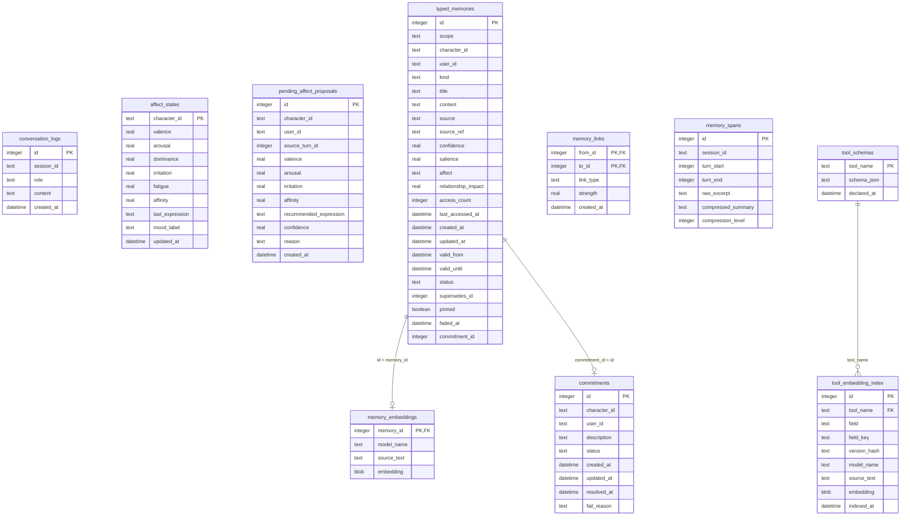

# `ene-store` クレート概要 & スキーマ設計仕様

`ene-store` クレートは、Ene ワークスペース唯一の永続化レイヤーです。SQLite データベース（`memory.db`）のコネクション管理、スキーマ移行（Migrations）、およびベクトル拡張モジュール（`sqlite-vec`）を用いた近傍ベクトル類似度検索（Cosine Similarity）の実装を担当します。

---

## 1. 依存関係と境界

### 物理的依存関係 (`Cargo.toml`)
- **依存先**: `sea-orm`, `sea-orm-migration`, `libsqlite3-sys`, `sqlite-vec`, `tokio`, `chrono`, `serde`
- **内部クレート依存先**: `ene-config`
- **禁止されている境界ルール**: `ene-store` は、`ene-mind`（脳・認知ロジック）や `ene-ai`（LLMプロバイダ）、`ene-runtime`（アクター）に依存してはなりません。これにより、他の任意のクレートから安全にインポートでき、循環参照を防止します。

---

## 2. データベース接続 & プラグマ設定

### WALモードとパフォーマンス最適化
SQLite 接続時、マルチスレッド並行処理性能と堅牢性を最大化するため、以下の接続オプション（プラグマ）を設定します。
*   `journal_mode = WAL`: Write-Ahead Logging モードを強制。読込処理が書込処理をブロックせず、並行スレッドでの高速実行が可能になります。
*   `synchronous = NORMAL`: 書込同期を「標準」に変更。WALモード下での安全性を維持しつつディスク同期I/Oを激減させます。
*   `busy_timeout = 5000`: 書込ロック時のタイムアウトを5秒に設定。データベースがロックされている場合にエラーをすぐ返さず待機（バックオフ）します。
*   `foreign_keys = ON`: 参照整合性（外部キー制約）の強制。

### `sqlite-vec` ベクトル拡張のグローバル登録
`init_sqlite_vec` 関数により、C言語の `sqlite3_auto_extension` API を用いて `sqlite-vec` モジュールを登録します。
- **機能**: `1.0 - vec_distance_cosine(embedding, ?)` などのベクトル操作用SQL関数をプロセス全体で利用可能にします。
- **安全性**: `std::sync::Once` により、重複登録を防ぎます。

---

## 3. テーブル定義 & スキーマ一覧

Migrator により、起動時に以下のテーブルが自動生成されます。

*   `typed_memories`: 回想記憶やエピソード記憶の属性データを保存。
*   `memory_embeddings`: `typed_memories` に対応する埋め込みベクトル（浮動小数点配列のバイト表現）を保存するベクトル専用シャドウテーブル。
*   `tool_embedding_index`: ツールRAG用のマルチベクトルインデックス（引数説明文などのベクトル）。
