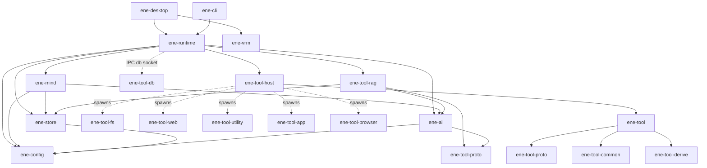
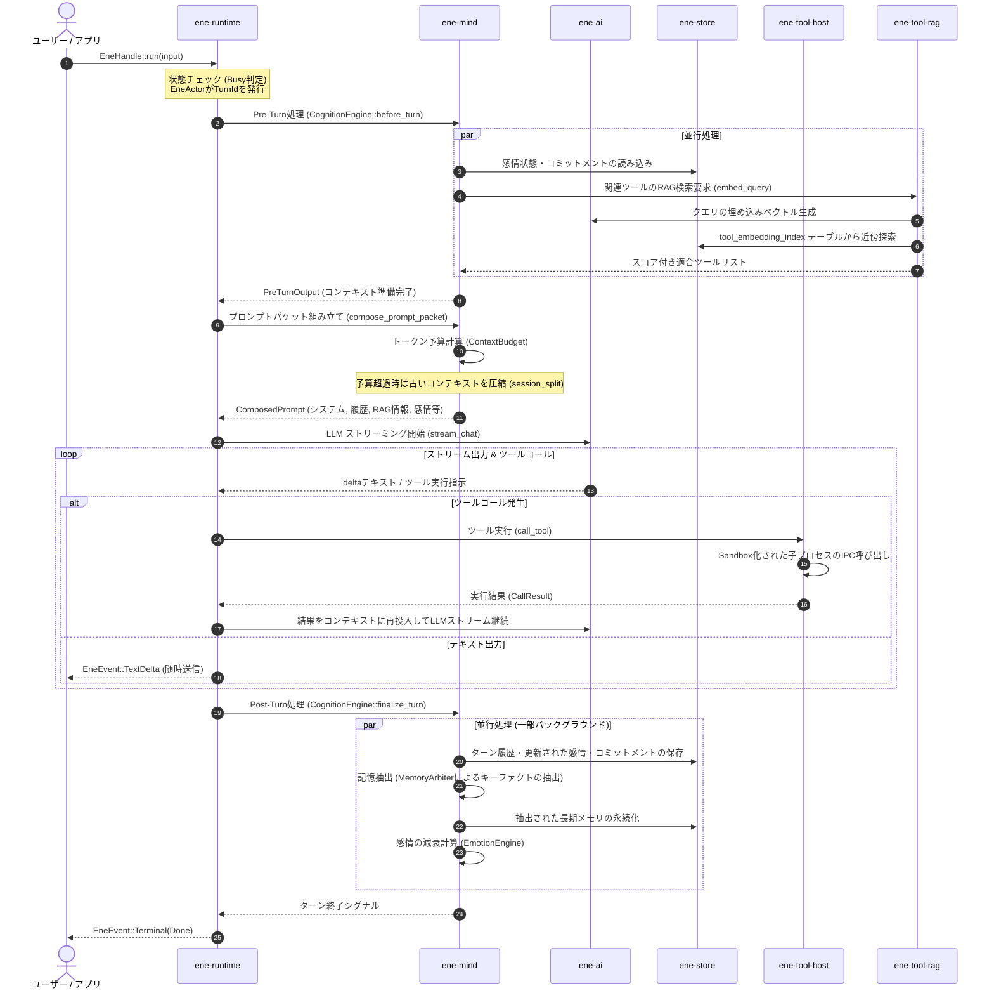

# Ene ワークスペース仕様設計書 インデックス & クレート関係マップ

本ドキュメントは、Ene ワークスペースを構成するすべての内部クレートおよびツールの設計仕様を、各関数・構造体・インターフェースレベルで解説する詳細仕様書のインデックスです。
大規模なリファクタリングを安全かつ漏れなく行うため、まずはシステム全体のつながり、境界ルール、データおよび制御のフローを定義します。

---

## 1. ワークスペースの全体構造と接続マップ

Ene は Rust Edition 2024 のマルチプロジェクト（Cargo ワークスペース）であり、関心の分離（Separation of Concerns）を厳格に適用したアーキテクチャを採用しています。

### クレート間の接続関係図 (Dependency Map)

### クレートの物理配置と責務

| クレート名 | フォルダ | 責務の概要 |
|---|---|---|
| `ene-runtime` | `crates/ene-runtime` | メインの実行アクターファサード。全体オーケストレーション、非同期シグナル中継、ツールプロセスIPCゲートウェイ。 |
| `ene-mind` | `crates/ene-mind` | 認知エンジン。ターン制御パイプライン、記憶抽出（Memory Arbiter）、文脈予算計算（Context Manager）、感情・表情調停（Emotion/Output Arbiter）。 |
| `ene-store` | `crates/ene-store` | SQLite（sqlite-vec）による永続化。アセット・メモリテーブルの排他管理。AI/Mind への依存は禁止。 |
| `ene-ai` | `crates/ene-ai` | LLM（OpenAI/Llama.cpp）および埋め込みベクトルのプロバイダー抽象化と具象実装。 |
| `ene-config` | `crates/ene-config` | `EneConfig` 構造体定義、CBSマクロ展開（`define_config!` / `define_tool_config!`）、キャラクターカードV3のロード。 |
| `ene-tool` | `crates/ene-tool` | ツール開発者向けのファサードクレート（proto/common/derive の再エクスポート）。 |
| `ene-tool-host` | `crates/ene-tool-host` | ツールプロセスの生存期間管理、環境変数によるIPCトークン伝播、MCP（Model Context Protocol）の仲介。 |
| `ene-tool-rag` | `crates/ene-tool-rag` | ツール RAG の実行。文脈に対応したツールの埋め込み類似度検索とLLMリランク。 |
| `ene-tool-proto` | `crates/ene-tool-proto` | IPC メッセージ（`IpcRequest` / `IpcResponse`）および `ToolSpec` 等のバイナリ境界データ構造定義。 |
| `ene-tool-common`| `crates/ene-tool-common`| `ToolAction` トレイト、HTMLパース（htmd）等のツール共通ユーティリティ。 |
| `ene-tool-derive`| `crates/ene-tool-derive`| `#[derive(ToolSpec)]` および `#[derive(ToolAction)]` プロシージャルマクロ。 |
| `ene-tool-db` | `crates/ene-tool-db` | ツールプロセスがホスト経由でSQLiteにCRUDアクセスするためのIPCクライアントライブラリ。 |
| `ene-vrm` | `crates/ene-vrm` | wgpu 搭載 3D VRM 1.0 レンダラー。Mind/Runtime から完全に独立。 |

---

## 2. 厳格な境界ルール (Architectural Boundaries)

リファクタリングにあたり、以下の境界ルールを厳守する必要があります。違反する依存の追加は循環参照を引き起こしビルド不能になるか、ドメインを汚染します。

1. **`ene-store` ↛ `ene-ai` / `ene-mind`**
   - 永続データベース（`ene-store`）は、AI側のプロバイダー設定や認知ロジックに一切関与してはなりません。記憶をロード・セーブする「純粋な入れ物」である必要があります。
2. **`ene-mind` ↛ `ene-runtime` / `ene-tool-host`**
   - 認知の脳（`ene-mind`）はアクターチャネルの多重化やOSのスレッド、ツールのプロセス起動方法（`ene-runtime` や `ene-tool-host`）を知ってはなりません。純粋な状態遷移マシンとして動作します。
3. **`ene-tool` ↛ `ene-runtime` / `ene-mind` / `ene-store`**
   - ツールインターフェースはそれ自体で完結したABI（アプリケーション・バイナリ・インターフェース）である必要があります。ホストのランタイムや記憶ストアの具象型を参照してはなりません。
4. **`ene-vrm` ↛ `ene-mind` / `ene-runtime`**
   - 3Dモデル描画ライブラリである `ene-vrm` は、会話や感情の状態管理と完全に切り離され、純粋なモーションと表情、テクスチャの描画に専念しなければなりません。

---

## 3. 会話ターンにおけるクレート間のデータ・制御フロー (Core Turn Flow)

ユーザーからの1つのチャット入力に対し、各クレートがどのように協調して制御とデータを引き渡していくかを以下に示します。

---

## 4. プロトコル & IPC セキュリティ境界

ワークスペース内のプロセス境界と通信路について整理します。

### 1. ツールプロセス IPC (`ene-tool-proto`)
- **トランスポート**: Unixドメインソケット（Mac/Linux） / 名前付きパイプ（Windows）。
- **シリアライズ**: 行区切り JSON (JSON Lines)、長さプレフィックス付きメッセージパッシング。
- **認可制御**: ホスト側がツール起動時に環境変数経由で一時的なトークンを渡し、接続開始時のハンドシェイクで検証。
- **データ制約**:
  - `IpcRequest::DeclareSchema` / `IpcRequest::Insert` などの構造化データのみ。
  - SQLを直接実行することはできず、`ene-runtime` の `DbIpcServer` で検証後にパラメータ化されたプレフィックス制限付きSQLite文へと変換されます。

---

## 5. 各仕様書へのリンク

階層化された詳細な仕様書（関数・構造体・メソッドレベル）は以下から参照できます。

*   [ene-runtime 詳細仕様書](ene-runtime/index.md)
    *   [EneHandle / EneActor ライフサイクルと通信](ene-runtime/handle.md)
    *   [DbIpcServer / ツールDBプロキシセキュリティ](ene-runtime/db_server.md)
    *   [会話ストリーミング & アクター制御ループ](ene-runtime/streaming.md)
    *   [MessageBuildContext / プロンプトフォーマット](ene-runtime/message_builder.md)
*   [ene-mind 詳細仕様書](ene-mind/index.md)
    *   [CognitionEngine / ターンライフサイクル](ene-mind/engine.md)
    *   [RecallPlanner / ハイブリッドメモリ検索](ene-mind/recall.md)
    *   [MemoryArbiter / 長期記憶抽出 & 減衰](ene-mind/memory_writer.md)
    *   [EmotionEngine / PADモデル感情状態](ene-mind/emotion.md)
    *   [ContextManager / セッション圧縮分割](ene-mind/context.md)
    *   [ConversationSession / キャラクターカードCBS](ene-mind/session.md)
    *   [Proactive Speech / 能動能動話話判断](ene-mind/proactive.md)
*   [ene-store 詳細仕様書](ene-store/index.md)
    *   [MemoryStore / SQLite接続と移行](ene-store/store.md)
    *   [TypedMemory / 類似度探索クエリ](ene-store/typed_memory.md)
    *   [Commitment / 約束・タスク台帳](ene-store/commitment.md)
*   [ene-config 詳細仕様書](ene-config/index.md)
*   [ene-ai 詳細仕様書](ene-ai/index.md)
*   [ツールシステム (ene-tool-*) 詳細仕様書](ene-tool-system/index.md)
    *   [IPCプロトコル / Sandbox](ene-tool-system/proto.md)
    *   [ToolHostManager / ライフサイクル](ene-tool-system/host.md)
    *   [ToolRAG / ハイブリッド埋め込み & Rerank](ene-tool-system/rag.md)
    *   [ene-tool-db / ツールDBクライアント](ene-tool-system/db.md)
    *   [Derive Macros / コード生成](ene-tool-system/derive.md)
*   [ene-vrm 詳細仕様書](ene-vrm/index.md)
