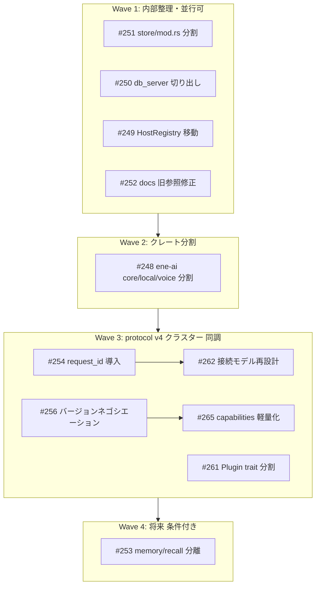

# v0.1.0 大規模リファクタリング統合実装計画

## 対象 issue（milestone v0.1.0 の type:refactor + chore）

| # | タイトル | 優先度 | 種別 |
|---|---|---|---|
| [#248](https://github.com/pexisgle/ene/issues/248) | ene-ai を core/local/voice に分割 | high | クレート分割 |
| [#249](https://github.com/pexisgle/ene/issues/249) | HostRegistry と run_tool_server を ene-plugin へ移動 | medium | 責務移動 |
| [#250](https://github.com/pexisgle/ene/issues/250) | db_server.rs を runtime から切り出し | medium | 責務移動 |
| [#251](https://github.com/pexisgle/ene/issues/251) | store/mod.rs をサブモジュールに分割 | low | 内部 refactor |
| [#252](https://github.com/pexisgle/ene/issues/252) | stale ene-tool-proto ディレクトリ削除 | low | chore |
| [#253](https://github.com/pexisgle/ene/issues/253) | memory_writer/recall を別クレート化 | low | 将来項目 |
| [#261](https://github.com/pexisgle/ene/issues/261) | Plugin trait 分割と ToolProvider 統合 | medium | API 再設計 |
| [#262](https://github.com/pexisgle/ene/issues/262) | 単一接続 Mutex モデルの再設計 | medium | protocol v4 |
| [#265](https://github.com/pexisgle/ene/issues/265) | capabilities から ToolSpec 詳細除去 | medium | protocol v4 |

同調させる feature: [#254](https://github.com/pexisgle/ene/issues/254)（request_id 導入）、[#256](https://github.com/pexisgle/ene/issues/256)（バージョンネゴシエーション）

## 現状検証メモ

- `crates/ene-tool-proto/` は既に削除済み。#252 は**ドキュメント参照の修正のみ未完了**（`ene-tool` / `ene-tool-proto` / `ene-tool-host` への旧参照が docs/ の40超ファイルに残存。例: [docs/reference/architecture/api-v1.md](docs/reference/architecture/api-v1.md)、`docs/reference/api/ene-tool*.md` 系）。
- [crates/ene-store/src/store/mod.rs](crates/ene-store/src/store/mod.rs) = 4,728行、[crates/ene-runtime/src/db_server.rs](crates/ene-runtime/src/db_server.rs) = 1,358行（issue記載と一致）。
- [crates/ene-plugin-proto/src/](crates/ene-plugin-proto/src/) に `host_registry.rs` (10.3K) と `tool_server.rs` (8.5K) が存在（#249 と一致）。
- [crates/ene-ai/src/](crates/ene-ai/src/) に LLM(`openai.rs`,`llama_cpp/`,`local_llm/`)・embedding(`embedding/`)・voice(`local_tts.rs`,`local_stt.rs`,`silero_vad.rs`,`g2p.rs`,`audio.rs`,`ort_init.rs`)・asset(`gguf/`) が混在（#248 と一致）。

## ウェーブ構成と依存関係

- Wave 1 の4件は互いに独立（異なるクレート/責務）。並行実施可。公開 API・ワイヤープロトコル不変。
- Wave 2 (#248) はクレートグラフを変更するが、ワイヤープロトコルには非依存。Wave 1 後・Wave 3 前に実施し、v4 作業時の依存関係手戻りを避ける。
- Wave 3 は**単一の protocol v4 バージョンバンプとして同調実施**。`PLUGIN_IPC_PROTOCOL_VERSION` を一度だけ上げる。#254→#262、#256→#265 の順で設計。
- Wave 4 (#253) はトリガー条件（ene-mind が約25K LOC超過、独立バージョンング必要、複数チーム分離必要のいずれか）を満たすまで着手しない。

---

## Wave 1 — 内部整理（公開 API 不変・並行可）

### #251 store/mod.rs のサブモジュール分割（low）
- [crates/ene-store/src/store/mod.rs](crates/ene-store/src/store/mod.rs)（4,728行）をドメイン別サブモジュールへ分割: `memory.rs` / `session.rs` / `affect.rs` / `tool.rs` / `audit.rs` / `commitment.rs`。`mod.rs` は `MemoryStore` 構造体・コンストラクタ・re-export のみ（約500行以下）。
- 純粋な内部 refactor。`MemoryStore` 公開 API は不変。

### #250 db_server.rs の切り出し（medium）
- [crates/ene-runtime/src/db_server.rs](crates/ene-runtime/src/db_server.rs)（1,358行）を `ene-store` 内の `db_server` モジュールへ移動（Option 1。最もシンプル）。
- 移動後、`ene-runtime` の `Cargo.toml` から `sea-orm` 直接依存を除去。
- 境界ルール「ene-store のみ SQLite/SeaORM を所有」に整合。

### #249 HostRegistry と run_tool_server の移動（medium）
- [crates/ene-plugin-proto/src/host_registry.rs](crates/ene-plugin-proto/src/host_registry.rs) と [crates/ene-plugin-proto/src/tool_server.rs](crates/ene-plugin-proto/src/tool_server.rs) を `ene-plugin` へ移動。
- `ene-plugin-proto` はワイヤー型（message enum・framing・`IpcStream`/`IpcListener`・error・data構造）のみ保持。
- 全 consumer（`plugins/*`、host 側）の import を更新。

### #252 stale 参照のドキュメント修正（low・ディレクトリは既に削除済み）
- `crates/ene-tool-proto/` は削除済みのため、**ドキュメントの旧クレート名参照のみ修正**。
- `ene-tool`→`ene-plugin`、`ene-tool-proto`→`ene-plugin-proto`、`ene-tool-host`→`ene-plugin-host` へ置換。対象は [docs/reference/architecture/api-v1.md](docs/reference/architecture/api-v1.md)（crate map・依存ルール・mermaid）を最優先とし、`docs/reference/api/ene-tool*.md` 系・`docs/reference/spec/ene-tool-system/*`・対応する `docs/ja/` 配下。EN/JA 同期を必須とする。
- 旧クレート名の専用 doc ファイル（`ene-tool.md` 等）はリネーム or 統合を検討。

**Wave 1 検証:** `cargo fmt --all -- --check` / `cargo clippy --workspace -- -D warnings` / `cargo test --workspace`。公開 API 不変のため doc 再生成は不要（#252 の doc 修正を除く）。

---

## Wave 2 — クレート分割

### #248 ene-ai を core / local / voice に分割（high）
- 新クレート `ene-ai-local`、`ene-voice` を作成し、root [Cargo.toml](Cargo.toml) の `members`（`crates/*` で自動）と `[workspace.dependencies]` に追加。
- `ene-ai`（core）: traits, message, role, openai, config(LLM+embedding), resolve(LLM+embedding), retry, health。`llama-cpp-2` / `whisper-rs` / `ort` への依存を除去。
- `ene-ai-local`: `llama_cpp/`, `local_llm/`, `gguf/`, local embedding。`llama-cpp-2` を `local` feature 背後に。
- `ene-voice`: `audio.rs`, `local_stt.rs`, `local_tts.rs`, `silero_vad.rs`, `g2p.rs`, `ort_init.rs` + TTS/STT/VAD の config/resolve。独自の `define_config!` セクション（`voice.*` 等）を持つ。ggml シンボル競合を解消。
- `ene-plugin-host` は `ene-ai` core のみ依存に。
- 設定キー移動に伴い **config スキーマを CLI 経由で再生成**（`assets/schema/*` は手編集しない）。
- 架構ドキュメント（[docs/reference/architecture/overview.md](docs/reference/architecture/overview.md) 等）と EN/JA を更新。

**Wave 2 検証:** fmt / clippy / test --workspace、`cargo run -p ene-cli -- --help` で起動確認、config スキーマ再生成の diff 確認。

---

## Wave 3 — protocol v4 クラスター（同調実施・単一バンプ）

設計方針: `PLUGIN_IPC_PROTOCOL_VERSION`（[crates/ene-plugin-proto/src/ipc.rs](crates/ene-plugin-proto/src/ipc.rs)）を**一度だけ** v4 に上げる。host / 全 plugin / テストを同時に更新。以下の順で設計・実装する。

1. **#256 バージョンネゴシエーション導入（feature）** — ハンドシェイクに protocol version のネゴシエーションを追加。後続の v4 変更と将来バンプの基盤。
2. **#254 request_id 導入（feature）** — 非ストリーミング IPC 応答に `request_id` を付与し並行リクエストに対応。#262 の前提。
3. **#265 capabilities 軽量化（refactor）** — `PluginCapabilities.tools` を `Vec<ToolSpec>` から `usize`/`Vec<String>` へ。詳細定義は `ListTools` に統一。host の `PluginToolRegistry` は起動時に `ListTools` で一覧構築（[crates/ene-plugin-host/src/manager.rs](crates/ene-plugin-host/src/manager.rs)、[crates/ene-plugin-proto/src/capabilities.rs](crates/ene-plugin-proto/src/capabilities.rs)、[crates/ene-plugin/src/plugin.rs](crates/ene-plugin/src/plugin.rs)、`compat.rs`）。
4. **#262 接続モデル再設計（refactor）** — 単一 `Mutex<IpcPluginConnection>` を解消。`CallTool` にリクエストスコープの `CallContext`（conversation_id/turn_id）を埋め込み、接続スコープの `SetCallContext` を非推奨化。接続プール or チャネル分離（ツール呼び出し vs LLM ストリーム）を採用（[crates/ene-plugin-host/src/ipc_plugin.rs](crates/ene-plugin-host/src/ipc_plugin.rs)、`manager.rs`、[crates/ene-plugin/src/server.rs](crates/ene-plugin/src/server.rs)）。#254 の request_id に依存。
5. **#261 Plugin trait 分割（refactor）** — God trait `Plugin` を `ToolPlugin`/`LlmPlugin`/`EmbedPlugin`/`ConfigurablePlugin` 等に分割。`ToolProvider` を廃止・`ToolPluginAdapter`/`compat.rs` を不要化。`#[derive(ToolAction)]` / `ActionSetProvider` の DX は維持。全 `plugins/*` バイナリと `ene-tool-common` を移行（[crates/ene-plugin/src/plugin.rs](crates/ene-plugin/src/plugin.rs)、[crates/ene-plugin-proto/src/tool_provider.rs](crates/ene-plugin-proto/src/tool_provider.rs)）。

**Wave 3 検証:** fmt / clippy / test --workspace（`--all-targets`）、`/tool list` で全ツールバイナリを検証、[docs/reference/tools/sdk.md](docs/reference/tools/sdk.md)・[docs/guide/tools/write-a-tool.md](docs/guide/tools/write-a-tool.md) と EN/JA・IPC ドキュメントを更新。

---

## Wave 4 — 将来項目（条件付き・今回は着手しない）

### #253 memory_writer / recall の別クレート化（low）
- トリガー条件（`ene-mind` が約25K LOC超過 / 独立リリース・バージョニング必要 / 複数チームの分離作業必要）を満たすまで実施しない。
- 実施時: `ene-memory`（MemoryWriter + MemoryArbiter、約4,662 LOC）と `ene-recall`（recall planning + execution、約2,672 LOC）を抽出。`ene-mind` は後方互換のため抽出型を re-export。依存は `ene-store`/`ene-ai`/`ene-config` のみ。

---

## 横断ルール（全ウェーブ共通）

- 各ウェーブ完了ごとに: `cargo fmt --all -- --check` → focused check → `cargo clippy --workspace -- -D warnings` → `cargo test --workspace`（テスト/example 影響時は `--all-targets`）。`rtk cargo` / 必要なら `direnv exec . rtk cargo` を使用。
- 公開 API・設定キー変更時は rustdoc + リファレンス doc を更新し、EN/JA 同期。config スキーマは CLI 再生成（`assets/schema/*` 手編集禁止）。
- 境界ルール遵守: `ene-store` のみ DB 所有、`ene-mind` は runtime/tool-host 非依存、`ene-plugin-proto` はワイヤー ABI のみ。
- ワークスペースクレート依存は root `[workspace.dependencies]` + `{ workspace = true }`。
- 各 issue を独立 PR（Conventional Commits、`refactor(scope):` / `chore:` / `feat(scope):`）で分割し、レビュー容易性を確保。Wave 3 は同調が必要だが、PR は issue 単位で分割可（マージ順を #256→#254→#265→#262→#261 にする）。
- 秘密情報・生成ファイル・無関係なユーザー変更（現在 ` M .github/workflows/ci.yml`）に触れない。
