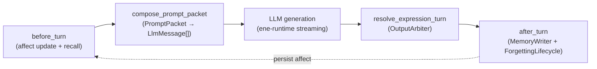

# `ene-mind` — API Reference

> **Crate:** `ene-mind`
> **Role:** Cognitive runtime for the Ene AI companion — Identity Kernel, typed memory write/recall, affect, expression arbitration, prompt composition, and commitments.

---

## Overview

`ene-mind` implements the [Ene Cognitive Runtime](../architecture/cognitive-runtime.md). It treats the LLM as an utterance generator operating on explicitly managed cognitive state, rather than as the entity that implicitly holds personality and memory. The crate owns:

- The **Identity Kernel** (immutable character identity, always in the prompt)
- **Typed memory** extraction, arbitration, and hybrid recall
- The **Emotion Engine** (deterministic affect + optional LLM classifier)
- **Expression arbitration** (affect → character expression, with hysteresis)
- **Context budget management** and rolling compression
- **Sectioned prompt packet** composition
- The **Companion Commitment Ledger** (promises, tasks, follow-ups)

### Crate Boundaries

- Depends on: `ene-store`, `ene-config`, `ene-ai`
- Does **NOT** depend on: `ene-runtime` (prevents circular dependencies)
- `ene-runtime` depends on `ene-mind` (not the other way around) to integrate the mind runtime into the streaming lifecycle.

### Turn Lifecycle

`CognitionEngine` does not run the LLM call itself — that step happens in `ene-runtime`'s streaming loop, between `compose_prompt_packet` and `resolve_expression_turn`.



1. **`before_turn`** — loads `AffectState`, runs the Emotion Engine (decay + appraisal + optional LLM classifier), plans and executes hybrid memory recall, and gathers active commitments.
2. **`compose_prompt_packet`** — compiles the Identity Kernel, selects style examples, loads the active scene summary, and packs everything into a token-budgeted `PromptPacket` → `Vec<LlmMessage>`.
3. **LLM generation** — `ene-runtime` streams the completion using the composed messages. Not part of this crate.
4. **`resolve_expression_turn`** — maps the post-turn `AffectState` (+ optional LLM expression hint) to a character expression via the `OutputArbiter`.
5. **`after_turn`** — extracts `MemoryCandidate`s (LLM-first; remember/forget safety net + tool grounding fallback; forget always applied), runs the `MemoryArbiter`, syncs the `CommitmentLedger`, applies the `ForgettingLifecycle`, and persists the affect state.

---

## `MindConfig`

Top-level configuration, registered under the `mind` key in `settings.json` (see [`ene-config`](./ene-config.md)).

```rust
pub struct MindConfig {
    /// Context and token budget management.
    pub context: ContextConfig,

    /// Memory extraction, search, and retention settings.
    pub memory: MindMemoryConfig,

    /// Emotion and expression processing settings.
    pub emotion: EmotionConfig,

    /// Character card compilation settings.
    pub character: CharacterMemoryConfig,
}
```

### `ContextConfig`

Token budget allocation, compression triggers, and rolling summarization. Sub-budget fields (`scene_summary_tokens`, `memory_budget_tokens`, `semantic_budget_tokens`, `style_example_budget_tokens`) must sum to `≤ max_prompt_tokens`; this is validated at startup by `validate_context_config`.

| Field | Type | Default | Purpose |
|---|---|---|---|
| `max_prompt_tokens` | `usize` | `12_000` | Total prompt token ceiling |
| `recent_turns` | `usize` | `8` | Recent conversation turns kept verbatim |
| `scene_summary_tokens` | `usize` | `800` | Budget for the active scene summary section |
| `memory_budget_tokens` | `usize` | `1_800` | Budget for recalled episodic/profile memories |
| `semantic_budget_tokens` | `usize` | `1_200` | Budget for semantic/lorebook memories |
| `style_example_budget_tokens` | `usize` | `600` | Budget for CCv3 style examples |
| `scene_turn_threshold` | `usize` | `12` | Turn count that triggers scene-level compression |
| `chapter_span_threshold` | `usize` | `5` | Scene spans before a chapter rollup |
| `arc_span_threshold` | `usize` | `3` | Chapter spans before an arc rollup |
| `compression_timeout_secs` | `u64` | `60` | Timeout for one compression summarization call |

### `MindMemoryConfig`

Memory extraction, hybrid search, retention, and MMR diversification settings.

| Field | Type | Default | Purpose |
|---|---|---|---|
| `default_forgetting_half_life_days` | `f64` | `30.0` | Half-life for decay and recency scoring |
| `min_confidence_to_persist` | `f64` | `0.65` | Minimum confidence to persist a candidate (clamped to `0.0..=1.0` on load) |
| `extraction_timeout_secs` | `u64` | `30` | Timeout for one LLM extraction call |
| `tool_grounding` | `ToolGroundingConfig` | — | Tool-result grounding settings |
| `recall_result_limit` | `usize` | `8` | Max typed memories requested per plan |
| `recall_similarity_threshold` | `f32` | `0.35` | Minimum vector similarity |
| `recall_min_score` | `f32` | `0.20` | Minimum hybrid total score |
| `mmr_lambda` | `f32` | `0.7` | MMR relevance-vs-diversity tradeoff (`0.0..=1.0`) |
| `mmr_duplicate_cluster_threshold` | `f32` | `0.75` | Lexical similarity for duplicate cluster merging |
| `mmr_min_slots_semantic` / `_episodic` / `_user_profile` / `_commitment` | `usize` | `1` each | Minimum reserved recall slots per kind |
| `mmr_source_diversity_bonus` | `f32` | `0.05` | Score bonus for introducing a new recall source |

### `ToolGroundingConfig`

| Field | Type | Default | Purpose |
|---|---|---|---|
| `max_summary_chars` | `usize` | `500` | Max characters kept per tool summary |
| `min_confidence` | `f32` | `0.60` | Minimum confidence for tool-derived candidates |

### `EmotionConfig`

| Field | Type | Default | Purpose |
|---|---|---|---|
| `enabled` | `bool` | `true` | Enable emotion processing |
| `decay_half_life_minutes` | `f64` | `30.0` | Half-life for affect decay |
| `expression_hysteresis_seconds` | `f64` | `4.0` | Minimum seconds between expression changes |
| `llm_can_propose_expression` | `bool` | `true` | Allow the LLM to propose an expression token |
| `llm_expression_is_advisory` | `bool` | `true` | Treat LLM proposals as advisory, not commands |
| `classifier_timeout_secs` | `u64` | `15` | Timeout for one LLM affect-classifier call |
| `classifier_min_confidence` | `f32` | `0.5` | Minimum confidence to blend LLM absolute affect estimates |
| `classifier_language` | `String` | `"en"` | Prompt library language (`en` or `ja`) for the classifier and output contract |

### `CharacterMemoryConfig`

| Field | Type | Default | Purpose |
|---|---|---|---|
| `identity_kernel_max_tokens` | `usize` | `400` | Approximate max token budget for the Identity Kernel |

---

## `CognitionEngine`

The central facade struct. Each field is a lightweight, mostly-stateless processor; `CognitionEngine::new()` wires them up with their defaults.

```rust
pub struct CognitionEngine {
    pub pre_turn: pre_turn::PreTurnAnalyzer,
    pub context: context::ContextManager,
    pub memory_writer: memory_writer::MemoryWriter,
    pub recall: recall::RecallPlanner,
    pub emotion: emotion::EmotionEngine,
    pub character: character::CharacterProcessor,
    pub prompt_packet: prompt_packet::PromptPacket,
    pub output: output::OutputArbiter,
    pub commitments: commitments::CommitmentLedger,
}
```

### Methods

| Method | Signature | Description |
|---|---|---|
| `new` | `fn new() -> Self` | Constructs the engine with default sub-processors. Also available via `Default`. |
| `validate_config` | `fn validate_config(config: &MindConfig) -> Result<(), CognitionError>` | Validates `context` sub-budgets sum to ≤ `max_prompt_tokens`. |
| `sync_character_memories` | `async fn sync_character_memories(&self, ctx: TurnContext<'_>, previous_hash: Option<u64>) -> Result<(CharacterMemorySyncReport, u64), CognitionError>` | Re-indexes CCv3 lorebook/style entries into typed memory when the card's content hash changes. Requires `ctx.store` and `ctx.embedder`. |
| `before_turn` | `async fn before_turn(&self, ctx: TurnContext<'_>) -> Result<PreTurnOutput, CognitionError>` | Loads affect, runs the Emotion Engine, plans + executes hybrid recall, and gathers active commitments. |
| `persist_affect_snapshot` | `async fn persist_affect_snapshot(store: &MemoryStore, affect: &AffectState) -> Result<(), CognitionError>` | Persists the affect state immediately after pre-turn update (survives stream cancel/failure). |
| `compose_prompt_packet` | `async fn compose_prompt_packet(&self, ctx: TurnContext<'_>, pre: &PreTurnOutput, prefetch: ComposePrefetch) -> Result<ComposedPrompt, CognitionError>` | Compiles the Identity Kernel, packs style/scene (from `prefetch` or fetched internally), packs everything under budget, and converts to `Vec<LlmMessage>`. |
| `after_turn` | `async fn after_turn(&self, store: &MemoryStore, config: &MindConfig, input: PostTurnInput<'_>, providers: MemoryWriteProviders<'_>) -> Result<(), CognitionError>` | Full synchronous post-turn path (`write_memories` → forgetting → affect persist). Used by tests and callers that need a single await. |
| `finalize_turn_post` | `async fn finalize_turn_post(&self, store: &MemoryStore, config: &MindConfig, input: &PostTurnInput<'_>) -> Result<(), CognitionError>` | Synchronous post-turn finalize: `upsert_affect_state` only. `ene-runtime` calls this before `Terminal`. |
| `write_memories_deferred` | `async fn write_memories_deferred(&self, store: &MemoryStore, config: &MindConfig, input: &OwnedPostTurnInput, providers: MemoryWriteProviders<'_>) -> Result<(), CognitionError>` | Deferred LLM extraction + arbiter, then natural forgetting. `ene-runtime` spawns this after `Terminal`; must not block the turn gate. |
| `resolve_expression_turn` | `fn resolve_expression_turn(&self, config: &MindConfig, card: &CharacterCardV3, affect: &AffectState, response_text: &str, llm_proposal: Option<&str>, previous_expression: &str, elapsed_since_change: Option<Duration>) -> (ExpressionDecision, AffectState)` | Resolves the final character expression for a completed assistant turn via the `OutputArbiter`. Returns the decision plus an `AffectState` with `last_expression` updated. |

---

## Lifecycle DTOs (`lifecycle`)

Turn input/output types shared across the engine's public methods.

### `HistoryEntry`

```rust
pub struct HistoryEntry {
    /// Speaker role (`Role` from `ene-ai`).
    pub role: Role,
    /// Message text.
    pub content: String,
}
```

### `TurnContext<'a>`

Input context for a single conversation turn. Passed by value (borrowed fields) to `before_turn`, `compose_prompt_packet`, and `sync_character_memories`.

```rust
pub struct TurnContext<'a> {
    pub config: &'a MindConfig,
    pub card: &'a CharacterCardV3,
    pub character_id: &'a str,
    pub user_name: &'a str,
    pub session_id: &'a str,
    pub user_input: &'a str,
    pub history: &'a [HistoryEntry],
    pub store: Option<&'a MemoryStore>,
    pub query_embedding: Option<&'a [f32]>,
    pub embedder: Option<&'a Arc<dyn EmbeddingProvider>>,
    pub llm_provider: Option<Arc<dyn LlmProvider>>,
    pub post_history_block: Option<&'a str>,
}
```

`TurnContext::recent_recall_turns(&self) -> Vec<RecallTurn<'_>>` builds the recall-planner's turn slice from `history`, bounded by `config.context.recent_turns`.

### `PreTurnOutput`

```rust
pub struct PreTurnOutput {
    pub recall_plan: RecallPlan,
    pub affect: AffectState,
    pub recalled: Vec<RecalledMemory>,
    pub commitments: Vec<ActiveCommitmentPrompt>,
    /// Classifier expression hint when confidence meets threshold.
    pub classifier_expression_hint: Option<String>,
}
```

### `ComposedPrompt` / `PromptPacketMeta`

```rust
pub struct ComposedPrompt {
    pub messages: Vec<LlmMessage>,
    pub meta: PromptPacketMeta,
}

pub struct PromptPacketMeta {
    pub identity_kernel_included: bool,
    pub style_example_count: usize,
    pub recalled_memory_count: usize,
    pub post_history_included: bool,
    pub scene_summary_included: bool,
    pub dropped_sections: Vec<PromptSectionKind>,
    pub packed_tokens: usize,
}
```

### `PostTurnInput<'a>`

```rust
pub struct PostTurnInput<'a> {
    pub turn: memory_writer::candidate::TurnInput<'a>,
    pub affect: AffectState,
    pub character_id: &'a str,
    pub user_id: &'a str,
}
```

---

## `character` — Identity Kernel & Lorebook Sync

### `IdentityKernel`

```rust
pub struct IdentityKernel {
    /// Character display name.
    pub name: String,
    /// Rendered identity kernel text (always injected first; never truncated).
    pub text: String,
    /// Post-history instructions kept out of the kernel body.
    pub post_history_instructions: Option<String>,
}
```

`IdentityKernel::has_post_history_instructions(&self) -> bool` — whether non-empty PHI text is available for the output-contract prompt section.

### `CharacterCompiler`

Deterministically compiles a CCv3 character card into an `IdentityKernel`. Core header lines (`Name`, `Role`, `Core personality`, `Speech style`, `Hard instruction`) are always included; optional sections (`system_prompt`, `description`, `scenario`, `creator_notes`) are appended only while the result stays within `max_tokens` (≈4 chars/token).

| Method | Signature | Description |
|---|---|---|
| `compile` | `fn compile(card: &CharacterCardV3, user_name: &str, max_tokens: usize) -> IdentityKernel` | Compiles the kernel with an explicit token budget. |

`CharacterProcessor` (in `character::mod`) is the facade most callers use: `compile_kernel`, `compile_kernel_default`, `sync_card_memories`, `select_style_examples`.

### Lorebook & Style Sync

| Item | Description |
|---|---|
| `LorebookIndexer::compile_entries(card, user_name) -> Vec<NewMemoryItem>` | Compiles CCv3 `character_book` entries into `MemoryKind::Semantic` items with `source_ref` under `ccv3:lorebook:*`. Constant entries are pinned; key-triggered entries prepend `Triggers: …` to the stored content. |
| `StyleExampleSelector::compile_items(card, user_name) -> Vec<NewMemoryItem>` | Compiles `mes_example` dialogue chunks into `ccv3:style:*` procedure memories. |
| `StyleExampleSelector::select(...) -> Vec<StyleExample>` | Selects style examples for the current turn via deterministic intent heuristics (greeting, comforting, joking, …). |
| `sync_character_memories(store, embedder, character_id, user_name, card, config, previous_hash) -> Result<(CharacterMemorySyncReport, u64), CognitionError>` | Full sync: computes a combined content hash, skips work when unchanged, archives stale rows, and inserts/supersedes changed entries. |
| `compute_card_memory_hash(card) -> u64` | Cheap combined lorebook+style content hash for skipping per-turn sync when the session hash already matches. |

```rust
pub struct CharacterMemorySyncReport {
    pub lorebook_inserted: usize,
    pub lorebook_updated: usize,
    pub style_inserted: usize,
    pub style_updated: usize,
    pub archived: usize,
    /// `true` when sync was skipped (unchanged card hash or disabled).
    pub skipped: bool,
}
```

---

## `emotion` — Emotion Engine

### `EmotionEngine`

```rust
pub struct EmotionEngine;

impl EmotionEngine {
    pub fn update_turn(&self, config: &EmotionConfig, input: &mut TurnAffectInput<'_>) -> AffectUpdateResult;
}
```

`update_turn` runs, in order: (1) exponential decay toward baseline based on `elapsed_since_update`, (2) deterministic appraisal of `user_message` (skipped when `llm_only`), (3) an optional advisory merge of `classifier_proposal` weighted by its confidence. It then clamps all dimensions and recomputes `mood_label` via `compute_mood_label`.

### `TurnAffectInput<'a>`

```rust
pub struct TurnAffectInput<'a> {
    pub state: &'a mut AffectState,
    pub user_message: &'a str,
    pub elapsed_since_update: Duration,
    pub recent_turn_count: usize,
    pub classifier_proposal: Option<AffectProposal>,
    pub classifier_min_confidence: f32,
    /// When true, skip deterministic appraisal (LLM-only mode).
    pub llm_only: bool,
}
```

`TurnAffectInput::with_proposal(self, proposal: AffectProposal) -> Self` — builder-style attachment of a classifier proposal.

### `AffectProposal`

Optional LLM affect classifier output: absolute post-conversation estimates (advisory only, blended below `classifier_min_confidence` is skipped).

```rust
pub struct AffectProposal {
    pub user_emotion: String,
    pub user_intent: String,
    pub valence: f32,
    pub arousal: f32,
    pub irritation: f32,
    pub affinity: f32,
    pub recommended_expression: String,
    pub confidence: f32,
    pub reason: String,
}
```

### `AffectUpdateResult` / `AffectUpdateReason` / `AffectDelta`

```rust
pub struct AffectUpdateResult {
    pub mood_label: String,
    pub reasons: Vec<AffectUpdateReason>,
}

pub struct AffectUpdateReason {
    /// Short category label (e.g. `decay`, `gratitude`, `classifier`).
    pub category: &'static str,
    pub detail: String,
    pub deltas: Vec<AffectDelta>,
}
```

`compute_mood_label(state: &AffectState) -> String` derives a human-readable label (`irritated`, `tired`, `cheerful`, `content`, `upset`, `down`, `alert`, `calm`, `curious`, `neutral`) from the PAD dimensions, checked in that priority order.

---

## `output` — Expression Arbiter

### `OutputArbiter`

```rust
pub struct OutputArbiter;

impl OutputArbiter {
    pub fn resolve(&self, config: &EmotionConfig, input: &ExpressionInput<'_>) -> ExpressionDecision;
}
```

Resolution order: affect → expression mapping (`affect_to_expression`), then optional LLM hint blending (advisory or command mode per `llm_expression_is_advisory`), then a lightweight response-text sentiment nudge, then hysteresis hold (unless `irritation_spike`), then fallback to `neutral`/nearest available expression.

### `ExpressionInput<'a>`

```rust
pub struct ExpressionInput<'a> {
    pub affect: &'a AffectState,
    pub available: &'a [ResolvedExpression],
    pub llm_proposal: Option<&'a str>,
    pub previous_expression: &'a str,
    pub elapsed_since_change: Option<Duration>,
    pub response_text: &'a str,
    pub irritation_spike: bool,
}
```

### `ExpressionDecision` / `ExpressionSource`

```rust
pub struct ExpressionDecision {
    pub expression: String,
    pub reason: String,
    pub source: ExpressionSource,
}

pub enum ExpressionSource {
    AffectMapping,
    LlmAdvisory,
    LlmCommand,
    HysteresisHold,
    FallbackNeutral,
}
```

Free functions: `affect_to_expression(state: &AffectState) -> &'static str` (PAD → candidate name) and `normalize_expression(name: &str, available: &[String]) -> String` (alias map + Levenshtein nearest-match fallback).

---

## `prompt_packet` — Sectioned Prompt Composition

### `PromptSectionKind`

Deterministic render order (also the drop-priority reference — see `context::ContextBudget`):

```
PlatformContract → IdentityKernel → BehaviorContract → CharacterState → SceneState
→ SemanticContext → UserProfile → ActiveCommitments → EpisodicMemories → StyleExamples
→ OutputContract → UserInput
```

`PlatformContract`, `IdentityKernel`, `OutputContract`, and `UserInput` are `is_required()` (never dropped on budget overflow). `heading()` returns the markdown heading rendered for system-block sections (e.g. `## Semantic Context`); `PlatformContract`, `IdentityKernel`, `OutputContract`, and `UserInput` render without a heading.

### `PromptSection`

```rust
pub struct PromptSection {
    pub kind: PromptSectionKind,
    pub content: String,
    pub required: bool,
    pub budget_tokens: usize,
}
```

### `PromptPacket`

```rust
pub struct PromptPacket {
    pub sections: Vec<PromptSection>,
    pub history: Vec<HistoryEntry>,
}
```

| Method | Signature | Description |
|---|---|---|
| `section` | `fn section(&self, kind: PromptSectionKind) -> Option<&PromptSection>` | First matching section. |
| `section_included` | `fn section_included(&self, kind: PromptSectionKind) -> bool` | Whether the section has non-empty content. |
| `to_llm_messages` | `fn to_llm_messages(&self) -> (Vec<LlmMessage>, PromptPacketMeta)` | Renders system sections (joined by blank lines) into one `LlmMessage::System`, appends `history` as individual messages, then the `OutputContract` (as a separate system message, if present), then the `UserInput` as the final `LlmMessage::User`. |
| `compose` | `fn compose(kernel, style_examples, recalled, commitments, affect_summary, history, post_history_block, user_input, max_prompt_tokens, style_example_budget_tokens) -> Self` | Legacy convenience constructor; prefer [`context::pack_prompt`] for budget-aware assembly. |

`classify_recalled_memories(recalled: &[RecalledMemory]) -> (Vec<&RecalledMemory>, Vec<&RecalledMemory>, Vec<&RecalledMemory>)` splits recalled memories into `(semantic, profile, episodic)` buckets by `MemoryKind`/`MemorySource`. `render_commitments_block(commitments: &[ActiveCommitmentPrompt]) -> String` renders the `## Active Commitments` body.

---

## `context` — Budget & Compression

### `ContextBudget` / `pack_prompt`

```rust
pub struct ContextBudget {
    pub total_tokens: usize,
    pub section_budgets: [usize; 12],
}

impl ContextBudget {
    pub fn from_config(config: &ContextConfig) -> Self;
    pub fn from_config_and_hints(config: &ContextConfig, hints: &RecallBudgetHints) -> Self;
}
```

```rust
pub struct PackInput {
    pub platform_contract: Option<String>,
    pub identity_kernel: IdentityKernel,
    pub behavior_contract: Option<String>,
    pub style_examples: Vec<StyleExample>,
    pub recalled: Vec<RecalledMemory>,
    pub commitments: Vec<ActiveCommitmentPrompt>,
    pub affect_summary: Option<String>,
    pub scene_summary: Option<String>,
    pub history: Vec<HistoryEntry>,
    pub output_contract: Option<String>,
    pub user_input: String,
}

pub struct PackedPrompt {
    pub packet: PromptPacket,
    pub meta: BudgetMeta,
}

pub struct BudgetMeta {
    /// Sections dropped due to overflow (lowest priority first).
    pub dropped: Vec<PromptSectionKind>,
    pub history_messages_dropped: usize,
    pub packed_tokens: usize,
}

pub fn pack_prompt(input: PackInput, budget: &ContextBudget) -> PackedPrompt;
```

Overflow policy, applied only when the packed total exceeds `budget.total_tokens`:

1. Per-section truncation to each section's own `budget_tokens` (required sections are exempt).
2. Whole-section drop, in `DROP_ORDER`: `StyleExamples → EpisodicMemories → SemanticContext → UserProfile → ActiveCommitments → CharacterState`.
3. Lowest-confidence-first trimming *within* the `EpisodicMemories → SemanticContext → UserProfile` recalled-memory sections (at least one memory kept per section).
4. Oldest-first history trimming, keeping at least `MIN_HISTORY_MESSAGES` (`2`).

`validate_context_config(config: &ContextConfig) -> Result<(), CognitionError>` checks the dynamic sub-budget sum against `max_prompt_tokens`, used by `CognitionEngine::validate_config`.

### Compression

| Item | Description |
|---|---|
| `CompressionLevel` | `Scene = 0`, `Chapter = 1`, `Arc = 2`. Stored in `memory_spans.compression_level`. |
| `CompressionReason` | `TurnThreshold { turn_count }` \| `ContextPressure { ratio }` \| `Manual`. |
| `evaluate_compression_trigger(config, turn_count, history_len) -> Option<CompressionReason>` | Fires on `turn_count >= scene_turn_threshold`, or history exceeding `1.25×` the recent-turns cap. |
| `execute_compression(store, provider, input: CompressionTaskInput) -> Result<CompressionResult, CognitionError>` | Synchronous summarization + `insert_memory_span`. |
| `spawn_compression_task(pending, store, provider, input)` / `poll_compression_result(pending)` | Background variant using a `oneshot` channel + `tokio::spawn`. |
| `load_active_scene_summary(store, session_id) -> Result<Option<ActiveSceneSummary>, CognitionError>` | Loads the current scene summary for prompt injection. |
| `maybe_roll_up_chapter(store, provider, session_id, character_name, user_name, config) -> Result<Option<CompressionResult>, CognitionError>` | Rolls scene spans into a chapter summary once `chapter_span_threshold` scenes exist. |
| `compression_has_usable_summary(result: &CompressionResult) -> bool` | Whether the summarization produced non-empty text. |

Summarization calls the LLM with a fixed system prompt (never rewrite identity/personality; 2–4 sentence summary; plain text only) under a `compression_timeout_secs` timeout; failure or timeout yields `None` (span still recorded, empty summary).

---

## `recall` — Recall Planning & Hybrid Execution

### `RecallPlanner` / `RecallPlan`

`RecallPlanner` is a pure, synchronous planner — it does **not** touch the database or call embedding providers.

```rust
pub struct RecallPlan {
    pub current_topic: String,
    pub semantic_queries: Vec<String>,
    pub episodic_queries: Vec<String>,
    pub required_kinds: Vec<MemoryKind>,
    pub scope: RecallScopeFilter,
    pub budget: RecallBudgetHints,
    pub search: RecallSearchHints,
}
```

| Method | Signature | Description |
|---|---|---|
| `plan` | `fn plan(input: &RecallPlannerInput<'_>, options: &RecallPlannerOptions) -> Result<RecallPlan, CognitionError>` | Infers `RecallIntent`s from the topic/affect, builds semantic/episodic query variants, and fills budget/search hints. Errors on empty turn text. |
| `to_memory_search_options` | `fn to_memory_search_options<'a>(plan: &'a RecallPlan, query_embedding: &'a [f32], model_name: &'a str, now: DateTime<Utc>, memory: &MindMemoryConfig) -> Query<'a>` | Maps the plan's primary query onto `ene-store::Query`, filling hybrid weights / commitment boost from `mind.memory.*` (#123). |
| `explain_results` | `fn explain_results(scored: Vec<ScoredMemory>) -> Vec<RecalledMemory>` | Attaches a `RecallReason` and score breakdown to each hybrid-search result. |

`RecallPlannerOptions::from_config(context: &ContextConfig, memory: &MindMemoryConfig) -> Self` derives planner options (budgets, thresholds) from the two config sections.

### `RecalledMemory` / `RecallReason`

```rust
pub struct RecalledMemory {
    pub item: MemoryItem,
    pub reason: RecallReason,
    pub score_breakdown: MemoryScoreBreakdown,
    pub sources: Vec<MemoryCandidateSource>,
}

pub enum RecallReason {
    SimilarTopic,
    RecentConversation,
    ActivePromise,
    CharacterLore,
    UserPreference,
    EmotionalContinuity,
    Pinned,
}
```

`infer_recall_reason(scored: &ScoredMemory) -> RecallReason` picks exactly one primary reason, in priority order: commitment → CCv3 lore → preference/profile → affective/high emotional-match (≥ `EMOTIONAL_MATCH_REASON_THRESHOLD = 0.85`) → recent/episodic → similar-topic fallback.

### `execute_hybrid_recall`

```rust
pub async fn execute_hybrid_recall(
    config: &MindConfig,
    input: &ExecuteRecallInput<'_>,
) -> Result<(RecallPlan, Vec<RecalledMemory>), CognitionError>
```

End-to-end pipeline used by `CognitionEngine::before_turn`: plan → hybrid vector+lexical search → MMR diversification (`MemoryDiversifyPipeline`) → map to `RecalledMemory` → merge lorebook key/constant matches → bump access counters. Legacy summaries and key facts are not merged; migrate them explicitly through the store/CLI migration API.

---

## `memory_writer` — Extraction, Arbiter, Forgetting

### `MemoryWriter`

```rust
pub struct MemoryWriter;

impl MemoryWriter {
    pub async fn write_memories(store: &MemoryStore, config: &MindConfig, input: &PostTurnInput<'_>, providers: MemoryWriteProviders<'_>) -> Result<(), CognitionError>;
    pub async fn finalize_turn(store: &MemoryStore, config: &MindConfig, input: &PostTurnInput<'_>) -> Result<(), CognitionError>;
    pub async fn apply_forgetting(store: &MemoryStore, config: &MindConfig, input: &PostTurnInput<'_>) -> Result<(), CognitionError>;
    pub async fn after_turn(store: &MemoryStore, config: &MindConfig, input: PostTurnInput<'_>, providers: MemoryWriteProviders<'_>) -> Result<(), CognitionError>;
}
```

`after_turn` = `write_memories` (LLM-first; remember/forget safety net + tool grounding → `MemoryArbiter` → `CommitmentLedger` sync) then `apply_forgetting` then `finalize_turn` (`upsert_affect_state` only). Production streaming in `ene-runtime` awaits `finalize_turn_post` (affect only) before `Terminal` and spawns `write_memories_deferred` (extraction + forgetting) afterward. Hosts must call `CognitionEngine` methods — not `MemoryWriter` directly (#121).

### `MemoryCandidate`

Intermediate representation produced by extractors, consumed by the `MemoryArbiter`.

```rust
pub struct MemoryCandidate {
    pub kind: MemoryKind,
    pub title: String,
    pub content: String,
    /// Exact quote from the conversation that triggered extraction.
    pub source_quote: String,
    pub confidence: f32,
    /// `false` for deletion-request candidates.
    pub should_persist: bool,
    /// For deletion requests: the key used to look up the target memory.
    pub deletion_target_key: Option<String>,
    /// For commitment candidates: due date/time reference (e.g. "next week").
    pub commitment_due: Option<String>,
}
```

### `MemoryArbiter`

Validates, deduplicates, and resolves contradictions before persistence.

| Method | Signature | Description |
|---|---|---|
| `evaluate_all` | `fn evaluate_all(candidates: &[MemoryCandidate], existing: &[MemoryItem], ctx: &ArbiterContext<'_>) -> Vec<CandidateDecision>` | Pure decision function (no I/O); also rejects batch-duplicate candidates. |
| `arbitrate_and_apply` | `async fn arbitrate_and_apply(store: &MemoryStore, candidates: &[MemoryCandidate], ctx: &ArbiterContext<'_>) -> Result<Vec<AppliedDecision>, CognitionError>` | Loads active/faded/disputed existing memories, evaluates, and applies. |
| `apply_decisions` | `async fn apply_decisions(store: &MemoryStore, decisions: &[CandidateDecision]) -> Result<Vec<AppliedDecision>, CognitionError>` | Applies pre-computed decisions to the store. |

#### `ArbiterAction` / decision table

| Decision | When |
|---|---|
| `Persist(NewMemoryItem)` | Candidate passes validation and has no conflicts |
| `Ignore` | Low confidence, empty fields, `source_quote` not in turn, exact/semantic/batch duplicate, or deletion target not found |
| `Supersede { new_item, superseded_id }` | New evidence beats existing confidence by `supersede_confidence_delta` (default `0.05`) |
| `MarkDisputed { memory_id }` | Weak contradiction — confidence gap under `dispute_confidence_gap` (default `0.15`) |
| `MarkUserDeleted { memory_id }` | User deletion request matched an existing memory |
| `AskConfirmationLater` | Ambiguous contradiction, deferred to user confirmation |

`ArbiterOptions` (defaults): `min_confidence: 0.65`, `supersede_confidence_delta: 0.05`, `semantic_similarity_threshold: 0.85`, `dispute_confidence_gap: 0.15`. `ArbiterContext::semantic_matches: HashMap<usize, Vec<SemanticMatch>>` must be populated by the caller with pre-computed vector-search matches; the arbiter itself performs no embedding calls.

### `ForgettingLifecycle`

```rust
pub struct ForgettingLifecycle;

impl ForgettingLifecycle {
    pub async fn apply(store: &MemoryStore, ctx: &ForgettingContext<'_>, config: &MindMemoryConfig) -> Result<ForgettingReport, CognitionError>;
}

pub struct ForgettingReport {
    pub skipped: bool,
    pub faded_count: usize,
    pub archived_count: usize,
}
```

Handles only time-based `Active → Faded → Archived` decay (via `MemoryStore::apply_natural_decay_batch`, half-life from `default_forgetting_half_life_days`, batched at 256 rows). User-explicit forget and contradiction transitions (`UserDeleted`, `Disputed`, `Superseded`) remain in the `MemoryArbiter`. No-op (`skipped: true`) when `config.decay_enabled` is `false`.

### `tool_grounding`

| Function | Description |
|---|---|
| `summarize_tool_result(tool_name, raw_output, success, max_summary_chars) -> ToolResultSummary` | Normalizes raw tool output (masks large screenshot payloads to a fixed sentinel) and truncates to `max_summary_chars`. |
| `extract_tool_candidates(tool_results: &[ToolResultSummary], cfg: &ToolGroundingConfig) -> Vec<MemoryCandidate>` | Produces `Procedure` (success), `Reflection` (failure), and short `Episodic` (user-visible success) candidates, gated per-kind by `cfg`. All tool-derived candidates use an empty `source_quote` — the arbiter's quote check is skipped when `tool_results` is non-empty. |

---

## `commitments` — Companion Commitment Ledger

Promises, tasks, and follow-ups tracked in a dedicated `commitments` table (`ene-store`). The ledger is the sole source of truth for lifecycle and prompt injection (#124). Optional typed `MemoryKind::Commitment` rows may reference a ledger row via `typed_memories.commitment_id`. Surfaced in the prompt **independently** of vector recall similarity.

```rust
pub struct CommitmentLedger;
```

| Method | Signature | Description |
|---|---|---|
| `apply_commitment_candidates` | `async fn apply_commitment_candidates(store: &MemoryStore, ctx: &CommitmentSyncContext<'_>, candidates: &[MemoryCandidate]) -> Result<Vec<i64>, CognitionError>` | Ledger-first write for `MemoryKind::Commitment` candidates: inserts or supersedes active rows by normalized title; deletion-style candidates cancel matching active rows. |
| `arbitrate_apply_and_sync` | `async fn arbitrate_apply_and_sync(store, candidates, arbiter_ctx, sync_ctx) -> Result<(Vec<AppliedDecision>, Vec<i64>), CognitionError>` | Writes commitment candidates to the ledger first, then runs the Memory Arbiter on all other kinds. |
| `list_active` | `async fn list_active(store: &MemoryStore, character_id: &str, user_id: Option<&str>, limit: usize) -> Result<Vec<Commitment>, CognitionError>` | Lists active commitments (no similarity filtering). |
| `active_prompt_candidates` | `fn active_prompt_candidates(commitments: &[Commitment]) -> Vec<ActiveCommitmentPrompt>` | Maps to the lightweight prompt DTO. |
| `complete` / `cancel` | `async fn complete(store, id) -> Result<bool, CognitionError>` / `async fn cancel(...)` | Manual lifecycle transitions. |
| `mark_stale_overdue` | `async fn mark_stale_overdue(store: &MemoryStore, now: DateTime<Utc>) -> Result<usize, CognitionError>` | Marks overdue active rows (parsed `due_at`) as `Stale`. |

**Lifecycle:** `Active → Done \| Cancelled \| Stale`. `Commitment`/`CommitmentStatus`/`NewCommitment`/`ActiveCommitmentPrompt` are domain types owned by `ene-store` and re-exported at the crate root.

---

## `error` — `EneCognitionError` / `CognitionError`

`CognitionError` is a type alias for `EneCognitionError`; use either name interchangeably.

```rust
pub enum EneCognitionError {
    Memory(#[from] ene_store::EneMemoryError),
    Config(#[from] ene_config::EneConfigError),
    Provider(#[from] ene_ai::LlmProviderError),
    Embedding(#[from] ene_ai::EmbeddingError),
    ExtractionFailed(String),
    ArbitrationFailed(String),
    RecallFailed(String),
    EmotionFailed(String),
    PromptBuildError(String),
    BudgetExceeded(String),
    InvalidState(String),
    Other(String),
}

pub type CognitionError = EneCognitionError;
```

---

## `pre_turn` (stub)

```rust
pub struct PreTurnAnalyzer;
```

Reserved entry point for dedicated turn-intent classification and input analysis. Currently a placeholder — `CognitionEngine::before_turn` performs affect update and recall planning inline rather than delegating to `PreTurnAnalyzer`.

---

## Usage Sketch

```rust,no_run
use std::time::Duration;
use ene_mind::{CognitionEngine, MindConfig};
use ene_mind::lifecycle::{TurnContext, HistoryEntry, PostTurnInput};

async fn run_turn(
    engine: &CognitionEngine,
    config: &MindConfig,
    ctx: TurnContext<'_>,
) -> Result<(), Box<dyn std::error::Error>> {
    // 1. Pre-turn: affect update + recall planning + execution.
    let pre = engine.before_turn(TurnContext { ..ctx }).await?;

    // 2. Compose the sectioned prompt packet into LLM messages.
    let composed = engine.compose_prompt_packet(TurnContext { ..ctx }, &pre, ComposePrefetch::default()).await?;

    // 3. ene-runtime streams the LLM completion using `composed.messages`
    //    (not part of this crate).
    let response_text = "..."; // from the streaming loop

    // 4. Resolve the character expression for this turn.
    let (decision, updated_affect) = engine.resolve_expression_turn(
        config,
        ctx.card,
        &pre.affect,
        response_text,
        None,
        &pre.affect.last_expression,
        Some(Duration::from_secs(30)),
    );
    println!("expression: {} ({})", decision.expression, decision.reason);

    // 5. Post-turn: extraction, arbitration, forgetting, affect persistence.
    let store = ctx.store.expect("memory store required");
    engine
        .after_turn(
            store,
            config,
            PostTurnInput {
                turn: ene_mind::memory_writer::candidate::TurnInput {
                    user_message: ctx.user_input,
                    assistant_message: Some(response_text),
                    tool_results: &[],
                },
                affect: updated_affect,
                character_id: ctx.character_id,
                user_id: ctx.user_name,
            },
        )
        .await?;

    Ok(())
}
```

---

## See Also

- [Cognitive Runtime Architecture (ADR)](../architecture/cognitive-runtime.md) — Full design rationale, turn lifecycle, and terminology
- [`ene-store`](./ene-store.md) — Typed memory store, hybrid search, commitment persistence
- [`ene-runtime`](./ene-runtime.md) — Orchestrates the full turn lifecycle and calls into this crate
- [`ene-mind`](./ene-mind.md) — Conversation history feeding `TurnContext::history`
