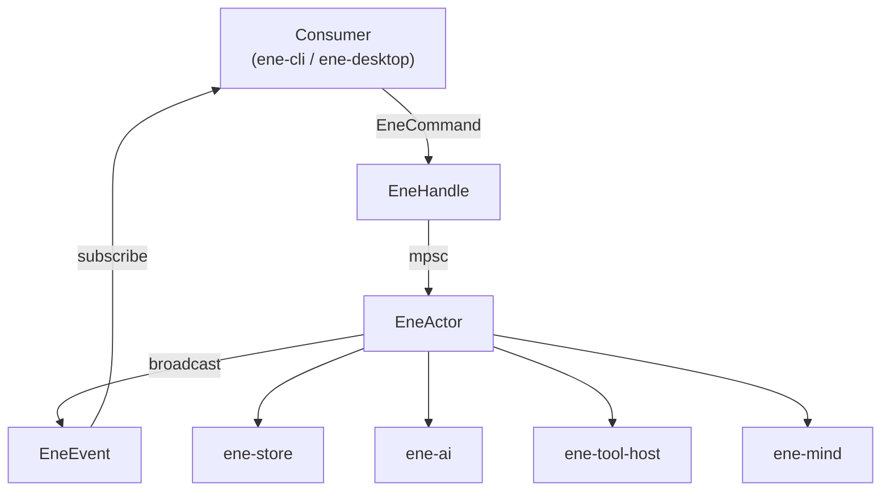
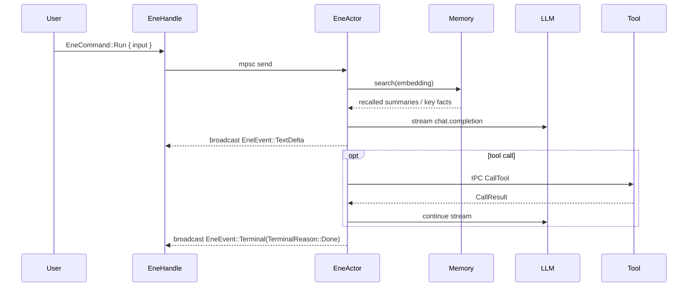

# `ene-runtime` — API Reference

> **Crate:** `ene-runtime`
> **Role:** Unified runtime facade integrating LLM streaming, tool orchestration, long-term memory, and session management through an actor-based message-passing architecture. Main entry point for all host applications (`ene-cli`, `ene-desktop`).
> **API v2:** Product path is `EneHandle::open(config, card)` → ready handle. `run` returns `TurnId` (Busy on conflict). Chat events are minimal; use `diagnostics()` for pipeline/memory/tools.


---

## Overview

`ene-runtime` provides the primary interface for all consumer applications. It wraps an internal actor loop in a thread-safe [`EneHandle`](#enehandle), exposing an async API for running conversations, managing configuration, querying memory, and calling tools.

The internal actor (`EneActor`, private) runs on a dedicated Tokio task. Commands are sent over an unbounded `mpsc` channel; events are broadcast to every subscriber through a `tokio::sync::broadcast` channel. The actor owns the tool registry, the memory store, the embedding provider, and the conversation session, and dispatches each turn to the mind streaming pipeline (see [Streaming Dispatch](#streaming-dispatch)).



---

## Data Flow (Single Turn)



Exactly one [`EneEvent::Terminal`](#eneevent) is emitted per `EneCommand::Run`, whether the run finished normally, errored, or was cancelled. An internal `AtomicBool` guard (`terminal_emitted`) shared between the actor and the stream task guarantees this even when a cancel races with the stream's own completion.

---

## `EneHandle`

`EneHandle` is the primary public interface. It is **thread-safe** and **cheaply cloneable**. Dropping the last clone sends an implicit `Shutdown` command so the actor task exits.

```rust
pub struct EneHandle { /* opaque */ }

impl Clone for EneHandle { /* ... */ }
```

### Constructor — async (ready before return)

| Method | Signature | Description |
|---|---|---|
| `open` | `async fn open(config: EneConfig, card: CharacterCardV3) -> Result<Self, EneRuntimeError>` | Initializes provider registry, embedder (when memory/tool-RAG need it), store, tools, mind session + card, and CCv3 warmup **before** returning `Ok`. Config/card file I/O stays in `ene-config` / the host. |

Helpers: `open_from_disk()`, `open_with_config(config)`, `open_ready(config, card)`.

### Conversation & lifecycle — sync

| Method | Signature | Description |
|---|---|---|
| `subscribe` | `fn subscribe(&self) -> EneEventReceiver` | Chat event broadcast receiver. |
| `run` | `fn run(&self, input: impl Into<String>) -> Result<TurnId, RunError>` | Starts a turn. Returns `RunError::Busy` if a turn is already in flight — never silently aborts. |
| `cancel` | `fn cancel(&self, turn: &TurnId) -> Result<(), CancelError>` | Cancels only the matching turn (`TurnMismatch` otherwise). |
| `decide_permission` | `fn decide_permission(...) -> Result<(), ActorDeadError>` | Resolves `PermissionRequired`. |
| `submit_user_input` | `fn submit_user_input(...) -> Result<(), ActorDeadError>` | Resolves `UserInputRequired`. |
| `diagnostics` | `fn diagnostics(&self) -> &EneDiagnostics` | Concrete diagnostics facade (not a UI-implemented trait). |

### Lifecycle — async

| Method | Signature | Description |
|---|---|---|
| `shutdown` | `async fn shutdown(&self, timeout: Duration) -> Result<(), ShutdownTimeout>` | Awaits actor drain. |

Snapshot / tools / memory / journal / manual split live on [`EneDiagnostics`](#enediagnostics) (`handle.diagnostics()`).

---

## `EneDiagnostics`

Concrete facade returned by `handle.diagnostics()`:

| Method | Purpose |
|---|---|
| `memory()` | [`MemoryQueryHandle`](#memoryqueryhandle) |
| `subscribe()` | Diagnostic stream (`PipelinePhase` / `PipelineMetrics`) |
| `get_snapshot` / `list_tools` / `call_tool` / `manual_split` | Inspection & tools |
| `set_character` | Hot-swap card (CLI `/card`) |
| `invalidate_tool_index` | Drop Tool RAG cache |

---

## `EneEvent` (chat bus)

Minimal chat events. All turn-scoped variants carry `turn: TurnId`.

```rust
pub enum EneEvent {
    TextDelta { turn: TurnId, delta: String },           // markers stripped
    Performance { turn: TurnId, cues: Vec<PerformanceCue>, source: CueSource },
    ToolCallStart { turn: TurnId, name: String, arguments: String },
    ToolCallResult { turn: TurnId, name: String, result: String },
    PermissionRequired { turn: TurnId, request_id: RequestId, action: String, target: String, description: String },
    UserInputRequired { turn: TurnId, request_id: RequestId, prompt: UserInputPrompt },
    ContextCompressed { turn: TurnId, level: String },  // thin signal
    Terminal { turn: TurnId, reason: TerminalReason },  // exactly once after history commit + affect finalize_turn
    StatusChanged { status: EneStatus },
}
```

Removed from chat (use diagnostics): `SpecialToken`, standalone `Expression`, `SessionSplit`, `PipelinePhase`, `PipelineMetrics`, `TaskProgress`.

`PerformanceCue` / `CueSource` live in `ene-mind` (runtime re-exports). No `CueSource::Host` without an explicit `perform` API.

---
## `TerminalReason`

Carried by `EneEvent::Terminal`. Exactly one of these is emitted per `EneCommand::Run`.

```rust
pub enum TerminalReason {
    /// The LLM stream completed normally (no more tool calls, provider finished).
    Done,
    /// The run terminated due to an error.
    Failed { message: String },
    /// The run was cancelled by the user via `EneCommand::Cancel`.
    Cancelled,
}
```

`TerminalReason` derives `PartialEq, Eq`, so consumers can match it directly (e.g. `matches!(reason, TerminalReason::Done)`).

---

## `EneStatus`

```rust
pub enum EneStatus {
    /// Not currently processing anything.
    Idle,
    /// An AI stream is running.
    Running,
    /// An error state (non-fatal).
    Error,
}
```

`Debug, Clone, Copy, PartialEq, Eq`. Broadcast via `EneEvent::StatusChanged` and mirrored nowhere else — there is no persistent "current status" getter; consumers track it themselves from the event stream.

---

## `EneStateSnapshot`

A read-only, point-in-time capture of actor state, returned by `handle.diagnostics().get_snapshot()`.

```rust
pub struct EneStateSnapshot {
    pub character_card: Option<CharacterCardV3>,
    pub history: Vec<HistoryEntry>,
    pub config: EneConfig,
    pub session_id: SessionId,
    pub card_name: CardName,
    pub memory: MemoryQueryHandle,
    pub current_turn_count: u32,
    pub session_started_at: DateTime<Utc>,
}
```

| Field | Description |
|---|---|
| `character_card` | The loaded character card, if any. |
| `history` | Conversation history as `HistoryEntry` pairs (role + content). |
| `config` | A clone of the currently active `EneConfig`. |
| `session_id` | The current session's unique identifier. |
| `card_name` | The active character card's name. |
| `memory` | A [`MemoryQueryHandle`](#memoryqueryhandle) — enabled only when memory is configured. |
| `current_turn_count` | Number of turns completed in the current session. |
| `session_started_at` | UTC timestamp of when the current session began. |

---

## `MemoryQueryHandle`

A cloneable, read-only handle for querying the memory subsystem outside the actor. Obtained from `EneStateSnapshot::memory`. Wraps `Option<Arc<ene_store::MemoryStore>>` and `Option<Arc<dyn EmbeddingProvider>>` — every method other than `is_enabled` returns `EneRuntimeError::Memory(..)` / `EneRuntimeError::Embedding(..)` when the corresponding piece is unavailable.

```rust
#[derive(Clone)]
pub struct MemoryQueryHandle { /* opaque */ }
```

### General

| Method | Signature | Description |
|---|---|---|
| `is_enabled` | `fn is_enabled(&self) -> bool` | `true` when both the memory store and the embedding provider are present. |
| `embed_query` | `async fn embed_query(&self, text: &str) -> Result<Vec<f32>, EneRuntimeError>` | Embeds a text query using the configured embedding provider. |

### Conversation summaries & key facts (legacy)

| Method | Signature | Description |
|---|---|---|
| `search_summaries` (removed) | — | `MemoryQueryHandle` no longer exposes this method. Use `search_summaries` on `MemoryStore` directly if needed (deprecated, prefer typed `Query::search`). |
| `list_recent_summaries` | `async fn list_recent_summaries(&self, card_name: &str, limit: usize) -> Result<Vec<ConversationSummary>, EneRuntimeError>` | Most recent summaries for a character card, in recency order. |
| `get_all_keyfacts` | `async fn get_all_keyfacts(&self, card_name: &str) -> Result<Vec<KeyFact>, EneRuntimeError>` | All legacy key facts stored for a character card. |

### Legacy → typed migration

| Method | Signature | Description |
|---|---|---|
| `count_legacy_rows` | `async fn count_legacy_rows(&self, card_name: &str) -> Result<LegacyRowCounts, EneRuntimeError>` | Counts legacy `conversation_summaries`/`conversation_keyfacts` rows for a card. |
| `migration_status` | `async fn migration_status(&self, card_name: &str) -> Result<Option<MigrationStatus>, EneRuntimeError>` | Current legacy → typed migration status, if any migration has been run. |
| `migrate_legacy` | `async fn migrate_legacy(&self, card_name: &str, user_id: &str, dry_run: bool) -> Result<LegacyMigrationReport, EneRuntimeError>` | Runs the one-shot legacy → typed memory migration. `dry_run` previews without writing. |
| `reset_legacy_memory` | `async fn reset_legacy_memory(&self, card_name: &str) -> Result<(), EneRuntimeError>` | **Destructive.** Clears all legacy memory rows for a character card. |

### Typed memory (`ene-mind` / `ene-store`)

| Method | Signature | Description |
|---|---|---|
| `list_typed_memories` | `async fn list_typed_memories(&self, character_id: &str, kind: Option<MemoryKind>, limit: usize) -> Result<Vec<MemoryItem>, EneRuntimeError>` | Lists typed memories for a character, optionally filtered by `MemoryKind`. |
| `inspect_typed_memory` | `async fn inspect_typed_memory(&self, id: i64) -> Result<Option<MemoryItem>, EneRuntimeError>` | Fetches a single typed memory by row id. |
| `search_typed_memories_hybrid` | `async fn search_typed_memories_hybrid(...) -> Result<Vec<ScoredMemory>, EneRuntimeError>` | Embeds `query_text` and runs scored search via `ene_mind::MemoryJournal` using `mind.memory.*` weights/thresholds (#123). |
| `pin_typed_memory` | `async fn pin_typed_memory(&self, id: i64, pinned: bool) -> Result<bool, EneRuntimeError>` | Sets or clears the pinned flag on a typed memory. |
| `transition_typed_memory_status` | `async fn transition_typed_memory_status(&self, id: i64, status: MemoryStatus) -> Result<bool, EneRuntimeError>` | Manually transitions a typed memory's lifecycle status (e.g. to `Archived`). |

### Affect state

| Method | Signature | Description |
|---|---|---|
| `show_affect_state` | `async fn show_affect_state(&self, character_id: &str) -> Result<AffectState, EneRuntimeError>` | Returns the current PAD affect state for a character. |
| `reset_affect_state` | `async fn reset_affect_state(&self, character_id: &str) -> Result<(), EneRuntimeError>` | Resets affect to `AffectState::neutral(character_id)`. |

### Commitments

| Method | Signature | Description |
|---|---|---|
| `list_active_commitments` | `async fn list_active_commitments(&self, character_id: &str, user_id: Option<&str>, limit: usize) -> Result<Vec<Commitment>, EneRuntimeError>` | Lists active commitments (promises/tasks) for a character/user. |
| `complete_commitment` | `async fn complete_commitment(&self, id: i64) -> Result<bool, EneRuntimeError>` | Marks a commitment as done. |

---

## `PermissionDecision` / `UserInputResponse` / `MultiAnswer`

Defined in the `streaming` module and re-exported at the crate root.

```rust
pub enum PermissionDecision {
    AllowOnce,
    AllowSession,
    Deny,
}

pub enum UserInputResponse {
    /// One answer per sub-question, in prompt order.
    Multi(Vec<MultiAnswer>),
    /// The user dismissed the entire prompt.
    Cancel,
}
```

`MultiAnswer` (re-exported `#[doc(no_inline)]` from `ene_tool_proto`) is one of `Selected { option: String }`, `Answer { text: String }`, or `Skip` — the user's response to a single sub-question in a `UserInputPrompt`.

---

## `message_builder`

Assembles an LLM message list for compatibility and debugging callers. `MessageBuildContext` and `build_messages` are re-exported at the crate root (`ene_runtime::{MessageBuildContext, build_messages}`); the individual prompt-section builders below are module-scoped (`ene_runtime::message_builder::build_system_prompt`, etc.) and used by the CLI debug command and the mind path's output-contract selection.

### `MessageBuildContext<'a>`

```rust
pub struct MessageBuildContext<'a> {
    pub card: &'a CharacterCardV3,
    pub user_input: &'a str,
    pub history: &'a [HistoryEntry],
    pub runtime_context: Option<&'a str>,
    pub runtime_rules: &'a str,
    pub user_name: &'a str,
    pub recalled_summaries: &'a [RecalledSummary],
    pub key_facts: &'a [KeyFact],
    pub prompts: &'a PromptLibrary,
}
```

### `build_messages`

```rust
pub fn build_messages(ctx: &MessageBuildContext<'_>) -> Result<Vec<LlmMessage>, EneRuntimeError>
```

Assembles the full message list in this order:

1. `System` — mascot-aware system prompt (behavior rules + character identity + scene), via `build_system_prompt`.
2. `System` — example messages (`mes_example`), first turn only.
3. `System` — recalled past-conversation summaries (memory recall).
4. `System` — known key facts about the user.
5. History — alternating `User`/`Assistant`/`System` turns.
6. `System` — Expression PHI (`<\|emo:name\|>` protocol + post-history instructions), via `build_expression_phi`.
7. `User` — the current user input, with an optional `[Runtime Context]` block appended.

### Module-scoped prompt builders

| Function | Signature | Description |
|---|---|---|
| `build_system_prompt` | `fn build_system_prompt(card: &CharacterCardV3, runtime_rules: &str, user_name: &str, prompts: &PromptLibrary) -> String` | Builds the mascot-context frame + behavior rules + character identity (system prompt, personality, background) + scene. Expands `{{char}}`/`{{user}}` CBS macros. |
| `build_expression_phi` | `fn build_expression_phi(card: &CharacterCardV3, prompts: &PromptLibrary) -> Option<String>` | Builds the `<\|emo:NAME\|>` emotion-token protocol block from the card's resolved expressions, merged with any manual `post_history_instructions`. Returns `None` only when both are empty. |
| `build_natural_dialogue_contract` | `fn build_natural_dialogue_contract(card: &CharacterCardV3, prompts: &PromptLibrary, user_name: &str) -> Option<String>` | Builds the engine-managed-expression output contract (#91): instructs the LLM to respond in plain dialogue with **no** inline emotion tokens, since expression is resolved after the turn by the cognitive runtime's Output Arbiter. |
| `build_cognitive_output_contract` | `fn build_cognitive_output_contract(card: &CharacterCardV3, prompts: &PromptLibrary, emotion_enabled: bool, user_name: &str) -> Option<String>` | Selects the post-history output block for the cognitive streaming path: `build_natural_dialogue_contract` when `emotion_enabled`, otherwise `build_expression_phi`. |

---

## `db_server`

`#[cfg(any(unix, windows))]` — compiled only on platforms with a supported IPC transport (Unix Domain Sockets or Windows Named Pipes). Implements a **per-tool** database IPC server backed by the shared `sea-orm` `memory.db` connection, so tool binaries never see raw SQL or the database file directly.

### `DbIpcServer`

```rust
pub struct DbIpcServer { /* opaque */ }

impl DbIpcServer {
    pub fn new(db: DatabaseConnection, socket_path: PathBuf, tool_name: String, prefix: String, auth_token: String) -> Self;
    pub async fn run(self) -> Result<(), DbServerError>;
}
```

One `DbIpcServer` is spawned per enabled tool in `build_tool_registry` (in `handle.rs`), each bound to its own socket/pipe under `ene_config::paths::tool_socket_dir()`. `run` loops accepting connections, backing off 500ms on transient accept errors rather than terminating the server task.

### `DbServerError`

```rust
pub enum DbServerError {
    Io(#[from] std::io::Error),
    Json(#[from] serde_json::Error),
    Db(#[from] sea_orm::DbErr),
    PermissionDenied(String),
    UnknownTable(String),
    UnknownColumn { table: String, column: String },
    Internal(String),
}
```

Maps to `ene_tool_db::DbResponse::Error { code, message }` via `DbErrorCode` (`PermissionDenied`, `UnknownTable`, `UnknownColumn`, `Internal`) before being sent back over the wire.

### Security model

- **Prefix enforcement.** Every tool declares its schema via `DbRequest::DeclareSchema`; all table names must start with the tool's assigned prefix (e.g. `fs_`, `utility_`), checked both at declaration time and on every subsequent request. Requests against undeclared tables or `sqlite_*`/`__tool_schemas` internal tables are rejected as `UnknownTable`/`PermissionDenied`.
- **Handshake.** The very first message on a new connection must be `DbRequest::Handshake { token }` carrying a per-tool, per-launch 128-bit pre-shared token (generated with a `blake3` XOF keyed by a nanosecond timestamp + monotonic counter, handed to the tool process via env var). Any other first message, or a wrong token, is rejected and the connection is closed before any schema/data operation is possible.
- **Identifier validation.** `validate_identifier` rejects any table/column/index name that is empty, longer than 64 characters, does not start with `[A-Za-z_]`, or contains any character outside `[A-Za-z0-9_]` — closing the SQL-injection vector that would otherwise exist when interpolating identifiers into generated `CREATE TABLE`/`CREATE INDEX` DDL (identifiers cannot be parameterized like values in SQL).
- **Unix socket permissions.** On Unix, the bound socket is `chmod`'d to `0o600` immediately after bind so only the owning user (and thus only the intended child process) can connect; on Windows, the per-handle ACL set by the kernel on named-pipe bind serves the same role.
- **No DDL exposed.** Tools cannot issue arbitrary SQL; only the structured `Insert`/`Upsert`/`Select`/`Update`/`Delete`/`Count`/`LastInsertRowId` request variants are dispatched, each validated against the tool's own declared schema before being translated into a parameterized `sea-query` statement.

---

## Re-exports

`ene-runtime` re-exports items from every crate below it in the dependency graph so consumers only need `ene_runtime::*` for the common path. All re-exports are annotated `#[doc(no_inline)]` except where noted, so rustdoc links point back to the source crate.

As of [API v2](../architecture/api-v2.md), this list is curated: it keeps only types that appear in `EneHandle`'s own public signatures (`EneStateSnapshot`, `EneEvent`, `HistoryEntry`, …) or that are otherwise high-traffic across `ene-cli`/`ene-desktop`. Types unused outside `ene-runtime` were dropped from the root — import them from their owning crate directly if you need them.

| Source crate | Re-exported items |
|---|---|
| `ene_config` | `EneConfig`, `CharacterCardV3` |
| `ene_ai` | `LlmMessage`, `LlmProvider`, `ProviderConfig`, `Role` |
| `ene_store` | `StoreConfig` |
| `ene_mind` | `CardName`, `SessionId`, `HistoryEntry`, `CueSource`, `PerformanceCue` |
| `ene_tool_proto` | `ToolSpec` |

Mind configuration types are owned by and imported directly from `ene-mind`. `ene-runtime`
depends on `ene-mind` normally, so its `define_config!` constructor registers the
`mind` section without a linker-only compatibility module.

### Crate-internal re-exports

These are the crate's own types, re-exported at the root from their defining modules (not `#[doc(no_inline)]`, since `ene-runtime` is the origin crate):

| Module | Items |
|---|---|
| `handle` | `ActorDeadError`, `EneCommand` *(module-local, not re-exported)*, `EneEvent`, `EneEventReceiver`, `EneHandle`, `EneStateSnapshot`, `EneStatus`, `ShutdownTimeout`, `TerminalReason` |
| `diagnostics` | `DiagnosticEvent`, `DiagnosticEventReceiver`, `EneDiagnostics`, `MemoryQueryHandle` |
| `error` | `EneRuntimeError` |
| `streaming` | `MultiAnswer` *(re-exported from `ene_tool_proto`, `#[doc(no_inline)]`)*, `PermissionDecision`, `UserInputResponse` |
| `message_builder` | `MessageBuildContext`, `build_messages` |
| `types` | `RequestId`, `TurnId`, `RunError`, `CancelError` |

`EneCommand` itself is `pub` from the `handle` module but is **not** re-exported at the crate root — consumers reach it only indirectly through `EneHandle`'s command-sending methods.

`streaming` and `message_builder` are the two modules kept `pub` (not `pub(crate)`) for reasons other than "apps need this": `streaming::{StreamContext, run_stream}` is exercised directly by `ene-runtime`'s own integration tests, and `message_builder`'s module-scoped prompt builders (`build_system_prompt`, `build_expression_phi`, …) are called directly by `ene-cli`'s `/prompt` debug command. Application code should still prefer `EneHandle` for normal use — these two modules are not part of the `EneHandle` facade and may change without a deprecation cycle.

---

## Supporting Types

| Type | Kind | Description |
|---|---|---|
| `ActorDeadError` | `thiserror` struct | Returned by sync `EneHandle` methods when the actor's `mpsc` channel is closed (actor task has exited). `#[error("Actor is no longer running")]`. |
| `ShutdownTimeout` | `thiserror` struct (`pub std::time::Duration`) | Returned by `EneHandle::shutdown` when the actor did not finish draining within the given timeout. `#[error("Actor did not shut down within {0:?}")]`. |
| `EneEventReceiver` | Wrapper struct | Wraps a `broadcast::Receiver<EneEvent>`. Exposes `try_recv(&mut self) -> Result<EneEvent, TryRecvError>` (non-blocking) and `async fn recv(&mut self) -> Result<EneEvent, RecvError>`. |
| `HistoryEntry` | `Debug, Clone` struct (from `ene-mind`) | One history entry: `{ role: Role, content: String }`. Replaces the former `ConversationEntry` name. |
| `EneStateSnapshot` | See [above](#enestatesnapshot). | |
| `EneStatus` | See [above](#enestatus). | |
| `PermissionDecision` | See [above](#permissiondecision--userinputresponse--multianswer). | |
| `UserInputResponse` | See [above](#permissiondecision--userinputresponse--multianswer). | |
| `MultiAnswer` | Re-exported from `ene_tool_proto` | See [above](#permissiondecision--userinputresponse--multianswer). |
| `RequestId` | `Debug, Clone, PartialEq, Eq, Hash, Serialize, Deserialize` newtype (`String`) | Opaque identifier correlating a `PermissionRequired`/`UserInputRequired` event with its later `decide_permission`/`submit_user_input` call. Constructible via `RequestId::new`, `From<String>`, `From<&str>`. |
| `EneRuntimeError` | `thiserror` enum | The crate's error type — see below. |

### `EneRuntimeError`

```rust
pub enum EneRuntimeError {
    NoCharacterCard,
    Provider(#[from] ene_ai::LlmProviderError),
    Config(#[from] ene_config::EneConfigError),
    Memory(#[from] ene_store::EneMemoryError),
    Session(#[from] ene_mind::EneSessionError),
    Tool(#[from] ene_tool_host::EneToolHostError),
    Embedding(#[from] ene_ai::EmbeddingError),
    ChannelClosed,
    MindPrerequisite(&'static str),
    Cognition(#[from] ene_mind::CognitionError),
}
```

All variants except `NoCharacterCard` and `ChannelClosed` wrap (`#[error(transparent)]`, `#[from]`) an underlying crate's error type, so callers can `?`-propagate from any subsystem call and, when needed, `match`/downcast on the wrapped error to dispatch on the precise cause (e.g. `Provider` → auth/rate-limit/network/content-filter).

---

## Streaming Dispatch

`crate::streaming::run_stream` is the single entry point the actor calls for every `Run` command. It validates mind prerequisites and then invokes the only streaming implementation:

```rust
if !store_config.enabled || session.memory.memory_store.is_none() {
    return Err(EneRuntimeError::MindPrerequisite("memory store"));
}
if ctx.embedder.is_none() {
    return Err(EneRuntimeError::MindPrerequisite("embedding provider"));
}
streaming_cognitive::run_stream_cognitive(ctx).await
```

- **Mind path** (`streaming_cognitive::run_stream_cognitive`, private module): delegates prompt composition, recall, affect, and post-turn work to `ene-mind`'s `CognitionEngine` (Phase A embed∥CCv3 sync → Phase B `before_turn`∥Tool RAG∥style∥scene → Phase C affect persist∥`compose_prompt_packet` → LLM stream → `resolve_expression_turn` → `finalize_turn_post` (affect) → commit history → `Terminal` → deferred `write_memories_deferred` (extraction + forgetting) + affect classifier). See [`ene-mind`](./ene-mind.md).
- If the store or embedder prerequisite is unavailable, `run_stream` returns `EneRuntimeError::MindPrerequisite` and emits a failed terminal event. There is no legacy streaming fallback.

The mind path uses the shared tool-execution machinery (`select_relevant_tools`, `perform_tool_executions`, `accumulate_tool_calls`, `finalize_tool_calls`) and the terminal-event guarantee (`emit_terminal`).

---

## Usage Example

```rust,no_run
use ene_config::{CharacterCardV3, ConfigStore};
use ene_runtime::{EneEvent, EneHandle, PermissionDecision, TerminalReason};

#[tokio::main]
async fn main() -> anyhow::Result<()> {
    let config = ConfigStore::try_load(/* … */)?;
    let card = CharacterCardV3::default(); // or load from disk
    let handle = EneHandle::open(config, card).await?;

    let mut rx = handle.subscribe();
    let turn = handle.run("Hello! What can you do?")?;

    loop {
        match rx.recv().await? {
            EneEvent::TextDelta { turn: t, delta } if t == turn => print!("{delta}"),
            EneEvent::Performance { turn: t, cues, .. } if t == turn => {
                for cue in cues {
                    eprintln!("[performance: {}]", cue.name);
                }
            }
            EneEvent::ToolCallStart { turn: t, name, .. } if t == turn => {
                eprintln!("[tool: {name}]");
            }
            EneEvent::PermissionRequired {
                turn: t,
                request_id,
                action,
                target,
                ..
            } if t == turn => {
                eprintln!("Permission requested: {action} on {target}");
                handle.decide_permission(request_id, PermissionDecision::AllowOnce)?;
            }
            EneEvent::Terminal {
                turn: t,
                reason: TerminalReason::Done,
            } if t == turn => break,
            EneEvent::Terminal {
                turn: t,
                reason: TerminalReason::Cancelled,
            } if t == turn => {
                eprintln!("cancelled");
                break;
            }
            EneEvent::Terminal {
                turn: t,
                reason: TerminalReason::Failed { message },
            } if t == turn => {
                eprintln!("error: {message}");
                break;
            }
            _ => {}
        }
    }
    println!();

    handle.shutdown(std::time::Duration::from_secs(5)).await?;
    Ok(())
}
```

---

## See Also

- [`ene-mind`](./ene-mind.md) — Cognitive runtime engine invoked by the streaming-cognitive dispatch path
- [Cognitive Runtime Architecture (ADR)](../architecture/cognitive-runtime.md) — Full design rationale behind the cognitive dispatch decision
- [API v2](../architecture/api-v2.md) — Locked host / event contracts
- [`ene-ai`](./ene-ai.md) — LLM and embedding provider traits
- [`ene-store`](./ene-store.md) — Persistent memory store
- [`ene-tool-host`](./ene-tool-host.md) — Tool process lifecycle and Tool RAG
- [`ene-config`](./ene-config.md) — Configuration loading and schema registration
