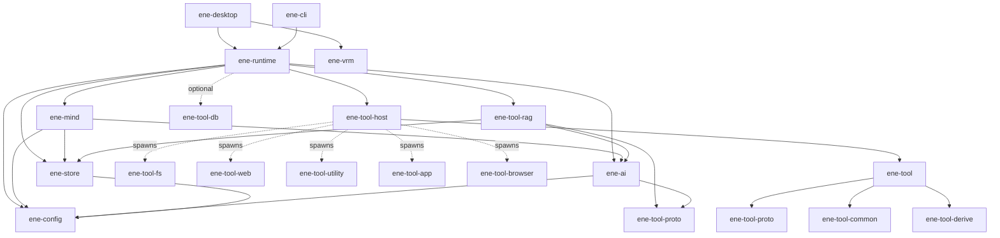

# Ene API Reference

> API Reference for the Ene crate library.

This section documents the public APIs of every library crate in the Ene workspace.
All crates target **Rust edition 2024** and are compiled with `tokio` as the async runtime.

The host contract is **API v2**: `EneHandle::open`, mandatory `TurnId`, single-flight `Busy`, minimal chat events, and `diagnostics()` for inspection. See [API v2](../architecture/api-v2.md).

---

## Crates

| Crate | Description | Docs |
|---|---|---|
| [`ene-runtime`](ene-runtime.md) | Actor-based runtime facade. Main entry point for host applications. | [→](ene-runtime.md) |
| [`ene-mind`](ene-mind.md) | Mind runtime — session, Identity Kernel, typed memory, affect, Performance arbitration, prompt packets, commitments. | [→](ene-mind.md) |
| [`ene-ai`](ene-ai.md) | LLM and embedding provider traits, OpenAI + local GGUF. | [→](ene-ai.md) |
| [`ene-store`](ene-store.md) | SQLite vector memory store (summaries, facts, tool index). | [→](ene-store.md) |
| [`ene-config`](ene-config.md) | Configuration loading, character cards, CBS macros, `Truncate`. | [→](ene-config.md) |
| [`ene-vrm`](ene-vrm.md) | VRM 1.0 model loader + MToon renderer for `ene-desktop` (wgpu). No mind/runtime dependency. | [→](ene-vrm.md) |
| [`ene-tool`](ene-tool.md) | Tool ABI facade (proto + common + derive re-exports). Preferred import for new tools. | [→](ene-tool.md) |
| [`ene-tool-host`](ene-tool-host.md) | Tool process lifecycle, IPC client, MCP server connections. | [→](ene-tool-host.md) |
| [`ene-tool-rag`](ene-tool-rag.md) | Tool RAG pipeline — multi-vector embedding, HyDE, LLM rerank, weighted field similarity. | [→](ene-tool-rag.md) |
| [`ene-tool-proto`](ene-tool-proto.md) | IPC wire protocol — `ToolSpec`, `IpcRequest`/`IpcResponse`, `ToolError`. | [→](ene-tool-proto.md) |
| [`ene-tool-common`](ene-tool-common.md) | `ToolAction` trait and helpers for tool binaries. | [→](ene-tool-common.md) |
| [`ene-tool-derive`](ene-tool-derive.md) | Proc-macros: `#[derive(ToolSpec)]`, `#[derive(ToolAction)]`. | [→](ene-tool-derive.md) |
| [`ene-tool-db`](ene-tool-db.md) | Typed CRUD database client for tool binaries via IPC. | [→](ene-tool-db.md) |

### Moved / absorbed

| Former crate | Now |
|---|---|
| `ene-provider` | Merged into [`ene-ai`](ene-ai.md) |
| `ene-embedding` | Merged into [`ene-ai`](ene-ai.md) |
| `ene-session` | Absorbed into [`ene-mind`](ene-mind.md) |
| `ene-common` | Folded into [`ene-config`](ene-config.md) (`truncate`) + [`ene-tool-common`](ene-tool-common.md) re-export |

`ene-core` was renamed/replaced by [`ene-runtime`](ene-runtime.md). There is no separate `ene-cognition` / `ene-memory` crate; cognition lives in `ene-mind`, persistence in `ene-store`.

---

## Dependency Graph

Dashed arrows (`-.->`) indicate runtime process spawning rather than a crate dependency.



**Dependency rules (enforced):**

- `ene-store` ↛ `ene-ai` / `ene-mind`
- `ene-mind` ↛ `ene-runtime` / `ene-tool-host`
- `ene-vrm` ↛ `ene-mind` / `ene-runtime`
- `ene-tool` ↛ `ene-runtime` / `ene-mind` / `ene-store`

`ene-runtime` links `ene-tool-db` only to open the shared per-tool DB IPC server socket (see [`ene-runtime` `db_server`](./ene-runtime.md#db_server)); it is not used for the runtime's own persistence.

New tool binaries should prefer:

```
ene-tool  (facade)
  → ene-tool-proto / ene-tool-common / ene-tool-derive
  ↘ ene-tool-db  (optional, for persistent state)
```

---

## Re-export Convention

When a crate re-exports an item from another workspace crate in its public API, it must annotate the re-export with `#[doc(no_inline)]`. This ensures that generated rustdoc links point back to the *original* crate's documentation page rather than duplicating it.

```rust
// In ene-tool/src/lib.rs (facade)
#[doc(no_inline)]
pub use ene_tool_proto::{ToolSpec, ToolError, IpcRequest, IpcResponse};
```

---

## Error & Async Conventions

See also [API v2](../architecture/api-v2.md).

### Async

- Every I/O-bound or actor-communicating boundary is `async fn` on the `tokio` runtime. Do not add sync wrappers that block on a runtime inside library code.
- `EneHandle`'s fire-and-forget methods (`run`, `cancel`, `decide_permission`, `submit_user_input`, `subscribe`) are sync channel sends. `run` returns `Result<TurnId, RunError>` (`Busy` | `ActorDead`); it does not wait for the turn to finish.
- Lifecycle and inspection that need an actor reply (`open`, `shutdown`, and methods on `diagnostics()` such as `get_snapshot`, `manual_split`, `list_tools`, `call_tool`) are `async fn` using oneshot replies.
- Traits that cross the async boundary (`LlmProvider`, `EmbeddingProvider`, `MemoryStore`, `ToolAction::execute`, `ToolRegistry::check_boundary`) use `#[async_trait::async_trait]`.

### Errors

- Library boundaries return `Result<T, E>` where `E` is a `thiserror`-derived enum, not `anyhow::Error`, `String`, or `Box<dyn Error>`. `anyhow` is a dev-dependency only.
- One public error name per crate, matching the crate: e.g. `EneRuntimeError`, `EneMemoryError` (`ene-store`), `CognitionError` / `EneSessionError` (`ene-mind`), `EneToolHostError`, `ToolError` (`ene-tool-proto`), `EneConfigError`, `AiError` (`ene-ai`; nested `LlmProviderError` / `EmbeddingError`).
- Narrower purpose-specific errors are fine alongside the crate-wide enum (`ActorDeadError`, `ShutdownTimeout`, `RunError`, `CancelError`, `DbServerError`).
- Avoid `unwrap()`/`expect()` outside tests — the workspace lints for this.

---

## Related Documentation

- [Architecture Overview](../architecture/overview.md)
- [API v2](../architecture/api-v2.md)
- [Cognitive Runtime Architecture (ADR)](../architecture/cognitive-runtime.md)
- [Memory System](../memory/memory.md)
- [Tool System](../tools/overview.md)
- [Configuration](../configuration/settings.md)
- [Applications](../../guide/apps/cli.md) / [Desktop](../../guide/apps/desktop.md)
