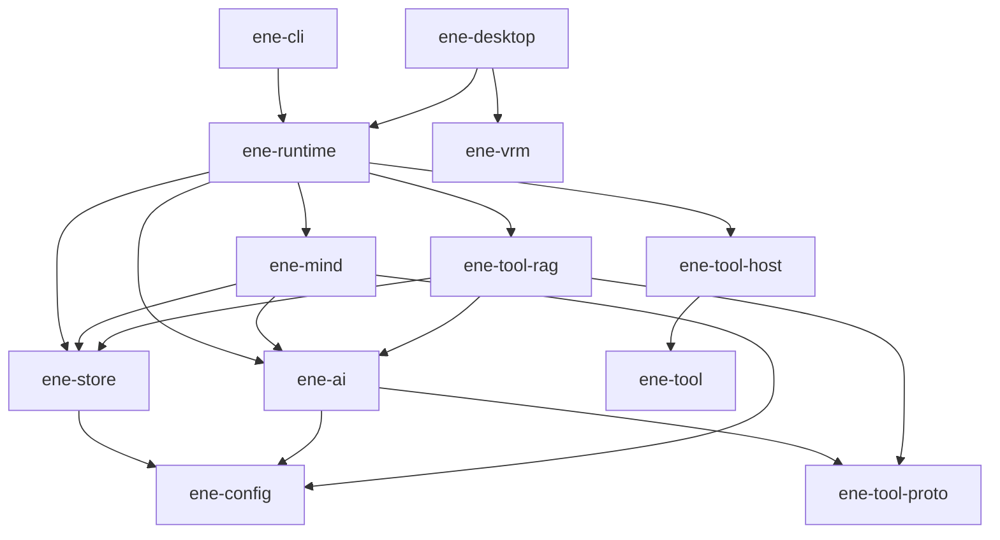

# ADR: API v1 — Functional Redesign

- **Status:** Accepted
- **Date:** 2026-07-13
- **Epic:** [#111](https://github.com/pexisgle/ene/issues/111)

## Context

ene exposes a minimal host contract with clear crate ownership: a ready `EneHandle::open` lifecycle, mandatory `TurnId` correlation, a minimal chat event bus, opt-in diagnostics, and policy knobs owned by the correct crates (`store.*` for persistence toggles, `mind.*` for recall/write/decay/emotion/performance).

## Locked Decisions

### Host / turn identity

1. **`TurnId` is mandatory.** `run(input) -> Result<TurnId, Busy | ActorDead>`. Every turn-scoped event and `cancel(turn)` carry that id.
2. **Concurrency:** single-flight. A second `run` while a turn is active returns `Busy` — never silent abort or broadcast-only correlation.
3. **Lifecycle:** `EneHandle::open(config, card) -> Result<ReadyHandle, _>`. Config file I/O stays in `ConfigStore` / `ene-config`.
4. **`Terminal` means chat-path turn completion** after conversation history commit and synchronous `finalize_turn` (affect persist). LLM memory extraction (`write_memories`), natural forgetting, and post-turn affect **classification** are fire-and-forget after `Terminal` and must not delay Done or keep the turn gate busy.

### Events

5. **Chat `EneEvent` is minimal:** `TextDelta`, `Performance`, interactive gates (`PermissionRequired` / `UserInputRequired`), tool start/result (when UI needs them), `Terminal`, `StatusChanged`, optional thin `ContextCompressed`.
6. **Diagnostics are opt-in:** `PipelinePhase`, `PipelineMetrics`, arbiter/compression detail — via `handle.diagnostics()`, not the chat bus.
7. **`EneDiagnostics`** is a concrete facade on the handle — UIs do not implement the trait.

### Providers (`ene-ai`)

8. **`EmbeddingProvider`:** one batch method on the trait. Single-text / query embed are convenience wrappers. HyDE / rerank are mind or tool-host pipeline steps, not embedding trait methods.

### Crate map

| Crate | Role |
|---|---|
| `ene-runtime` | Host / actor facade |
| `ene-mind` | Cognitive engine + session |
| `ene-store` | Persistence |
| `ene-ai` | LLM + embedding providers |
| `ene-tool` | Tool ABI facade (`ene-tool-proto` + `ene-tool-common` + `ene-tool-derive`) |
| `ene-tool-db` | IPC CRUD client for tool binaries → `ene-runtime`'s `DbIpcServer`; depends only on `ene-tool-proto` |
| `ene-tool-host` / `ene-tool-rag` / `ene-config` / `ene-vrm` | Tool orchestration, Tool RAG, configuration, VRM rendering |

### Dependency rules

- `ene-mind` ↛ `ene-runtime` / `ene-tool-host`
- `ene-store` ↛ `ene-ai` / `ene-mind` (no LLM, no embedding provider handle)
- `ene-tool` ↛ runtime / mind / store
- `ene-tool-host` ↛ `ene-ai` / `ene-store` / `ene-mind` — Tool RAG lives in `ene-tool-rag`
- `ene-tool-rag` depends on `ene-ai` (embedding, HyDE, rerank) + `ene-store` (persistent tool embeddings)
- **`PerformanceCue` lives in `ene-mind`**; runtime re-exports; **`ene-vrm` does not depend on mind/runtime**

### Config ownership

- Store side: `store.enabled` + `store.db_path` only
- All recall / write / decay / MMR / emotion / performance knobs under `mind.*`
- Corrupt JSON: CLI fail-hard (`ConfigStore::try_load`); desktop may soft-fallback via `ConfigStore::load` only

### Related epics

- [#119](https://github.com/pexisgle/ene/issues/119) Memory — ledger sole SoT; store has no embedder
- [#126](https://github.com/pexisgle/ene/issues/126) Performance — `PerformanceCue` in mind; no `CueSource::Host` without explicit `perform`
- [#135](https://github.com/pexisgle/ene/issues/135) Tools — name collision = hard error at every registry layer; wire vs host traits; `ToolSpec` LLM-facing only (`name`, `description`, `parameters`), internal RAG fields `#[doc(hidden)]` + `#[serde(skip)]`
- [#138](https://github.com/pexisgle/ene/issues/138) IPC — 9 request / 7 response variants; `UserInput` surfaced through `ToolError`
- [#158](https://github.com/pexisgle/ene/issues/158) ABI reconciliation — #135 contracts aligned with implementation: `CompositeToolRegistry` hard error, `SingleActionProvider` added

## Target Dependency Graph



Chat works with `store.enabled=false` (no SQLite memory). Memory features (recall, spans, typed memory) require `store.enabled=true` and a configured embedder.

## Host Contract (summary)

```rust
// Chat surface
EneHandle::open(config, card) -> Result<EneHandle, EneRuntimeError>;
handle.run(input) -> Result<TurnId, RunError>; // Busy | ActorDead
handle.cancel(turn: &TurnId) -> Result<(), CancelError>;
handle.subscribe() -> EneEventReceiver;
handle.decide_permission(...);
handle.submit_user_input(...);
handle.shutdown(timeout).await;

// Diagnostics (concrete)
handle.diagnostics() -> &EneDiagnostics;
```

### Chat `EneEvent`

| Variant | Notes |
|---|---|
| `TextDelta { turn, delta }` | Markers stripped |
| `Performance { turn, cues, source }` | Avatar cues for the UI |
| `ToolCallStart` / `ToolCallResult` | Optional for UI |
| `PermissionRequired` / `UserInputRequired` | Gates |
| `ContextCompressed { turn, … }` | Thin signal; details on diagnostics |
| `Terminal { turn, reason }` | Full turn done |
| `StatusChanged { status }` | Idle / Running / Error |

Diagnostics-only (not on the chat bus): `PipelinePhase`, `PipelineMetrics`, and detailed arbiter/compression events.

## Error & Async Conventions

- I/O and oneshot actor replies: `async fn` on tokio
- Fire-and-forget handle methods (`run`, `cancel`, gates): sync channel sends
- One public `thiserror` enum per crate; no `anyhow` / bare `String` / `Box<dyn Error>` at library boundaries
- No `unwrap` / `expect` outside tests

## Acceptance

- [ ] Sub-issues #112–#118 closed or explicitly deferred
- [ ] Locked decisions reflected in EN+JA docs
- [ ] Docs EN+JA match target contracts
- [ ] Workspace clippy/tests green under `direnv exec .`

## References

- Epic #111 and sub-issues #112–#118
- [Cognitive Runtime ADR](cognitive-runtime.md)
- [API Index](../api/index.md)
- [Streaming Events](../runtime/streaming-events.md)
