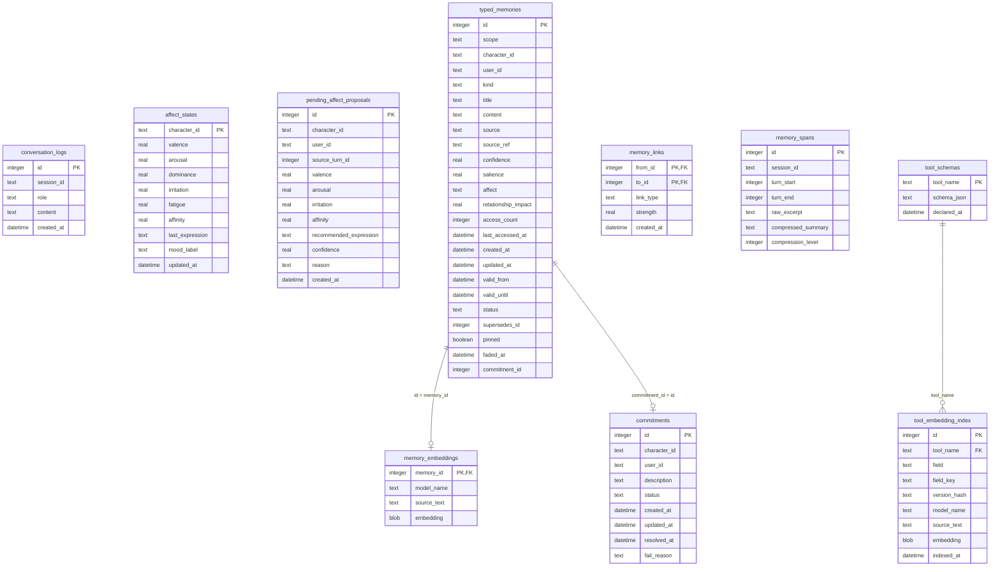

# `ene-store` Crate Role & DB Schema Specifications

The `ene-store` crate is Ene's isolated persistence layer. It manages SQLite database connections (`memory.db`), runs SeaORM schema migrations, and implements vector similarity searches (cosine distance) using the `sqlite-vec` extension.

---

## 1. Dependencies and Boundaries

### Physical Dependencies (`Cargo.toml`)
- **External Dependencies**: `sea-orm`, `sea-orm-migration`, `libsqlite3-sys`, `sqlite-vec`, `tokio`, `chrono`, `serde`
- **Workspace Dependencies**: `ene-config`
- **Architectural Rules**: `ene-store` must not depend on `ene-mind`, `ene-ai`, or `ene-runtime`. Decoupling the database layer prevents compilation cycles and ensures database actions remain strictly isolated.

---

## 2. Connection Settings & SQLite Pragmas

### WAL Mode and Performance Options
To optimize multi-threaded concurrent performance, the SQLite connection is configured with the following parameters:
*   `journal_mode = WAL`: Write-Ahead Logging. Ensures reading tasks do not block writing transactions.
*   `synchronous = NORMAL`: Sync state is relaxed for WAL mode, reducing disk sync I/O calls.
*   `busy_timeout = 5000`: Sets the lock timeout to 5 seconds. If locked, concurrent writers back off and retry.
*   `foreign_keys = ON`: Enforces referential integrity.

### `sqlite-vec` Registration
The `init_sqlite_vec` function registers the vector extension globally:
- **Mechanics**: Leverages SQLite's dynamic extension loading API `sqlite3_auto_extension` to bind the `sqlite-vec` binary.
- **Concurrency**: Guarded by `std::sync::Once` to prevent duplicate initialization. Provides functions like `1.0 - vec_distance_cosine(embedding, ?)` directly in SQL statements.

---

## 3. Database Schema Overview

The database Migrator generates the following tables:

*   `typed_memories`: Stores memory attributes, including status, pinning flags, and access counters.
*   `memory_embeddings`: A shadow table storing float32 embedding arrays as blobs.
*   `tool_embedding_index`: Multi-vector index for Tool RAG fields.
