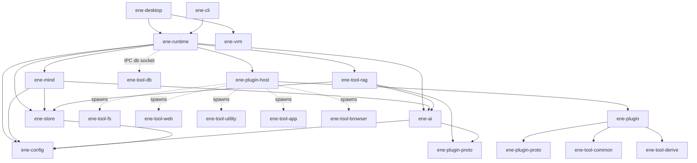
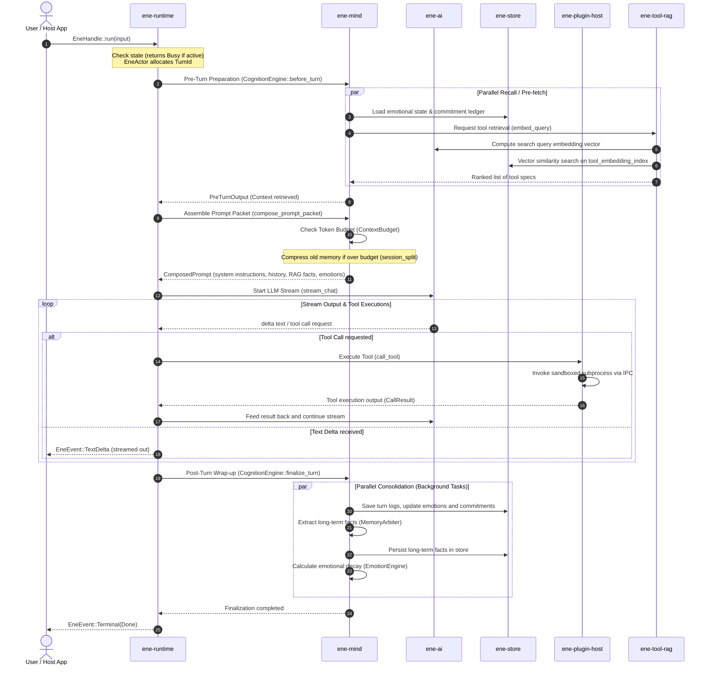

# Ene Workspace Specification Index & Crate Connection Map

This document is the index for the detailed technical specification of all internal crates and tools in the Ene workspace, analyzed at the struct, enum, function, and interface levels.
This mapping outlines the connections, boundary rules, data flow, and control paths across the workspace to support safe, comprehensive refactoring.

---

## 1. Workspace Structure & Connection Map

Ene is a modular Rust workspace (Edition 2024) that strictly separates concerns across layers.

### Crate Dependency & Communication Map

### Crate Roles and Locations

| Crate | Path | Role Overview |
|---|---|---|
| `ene-runtime` | `crates/ene-runtime` | Core runtime actor facade. Responsible for stream orchestration, UI event dispatch, and database socket hosting. |
| `ene-mind` | `crates/ene-mind` | Cognitive engine. Owns the turn pipeline, memory consolidation (Memory Arbiter), prompt budgeting (Context Manager), emotions, and expressions (Emotion/Output Arbiter). |
| `ene-store` | `crates/ene-store` | Database storage (SQLite + sqlite-vec). Isolates DB operations. Crucially: must not import AI or mind logic. |
| `ene-ai` | `crates/ene-ai` | LLM and embedding provider abstraction layer (OpenAI & local llama.cpp). |
| `ene-config` | `crates/ene-config` | Configuration structures, CBS macro definitions (`define_config!`), and Character Card V3 deserialization. |
| `ene-plugin` | `crates/ene-plugin` | SDK facade crate for tool developers. |
| `ene-plugin-host` | `crates/ene-plugin-host` | External tool process supervisor. Spawns sandbox environments, provisions IPC security tokens, and maps MCP servers. |
| `ene-tool-rag` | `crates/ene-tool-rag` | Embedding-based tool RAG. Indexes tool specs and reranks candidate lists via LLMs (e.g. `HybridRerankProvider`). |
| `ene-plugin-proto` | `crates/ene-plugin-proto` | IPC protocol serialization models (`IpcRequest` / `IpcResponse`) and `ToolSpec`. |
| `ene-tool-common`| `crates/ene-tool-common`| Common tool utilities (e.g. `ToolAction` trait, HTML-to-markdown translation). |
| `ene-tool-derive`| `crates/ene-tool-derive`| Procedural macros for automatic spec generation: `#[derive(ToolSpec)]` and `#[derive(ToolAction)]`. |
| `ene-tool-db` | `crates/ene-tool-db` | IPC client wrapper giving tools safe CRUD operations through the host socket. |
| `ene-vrm` | `crates/ene-vrm` | wgpu-based 3D VRM rendering module. Totally decoupled from mind and runtime. |

---

## 2. Architectural Boundaries & Isolation Rules

Refactoring must maintain these strict boundary constraints:

1. **`ene-store` ↛ `ene-ai` / `ene-mind`**
   - The persistence layer must be isolated from the AI providers and cognitive pipeline. It should serve only as a repository.
2. **`ene-mind` ↛ `ene-runtime` / `ene-plugin-host`**
   - The cognitive core should not depend on UI messaging channels, OS thread pools, or tool subprocess orchestration. It runs as a pure state machine.
3. **`ene-plugin` ↛ `ene-runtime` / `ene-mind` / `ene-store`**
   - Tool interface types must compile independently. They must never depend on core host runtime details or specific database/memory schemas.
4. **`ene-vrm` ↛ `ene-mind` / `ene-runtime`**
   - 3D rendering and motion simulation must remain decoupled from the active conversation/emotion states.

---

## 3. Core Conversational Turn Sequence

A conversational turn coordinates data and execution across crates as follows:

---

## 4. Protocols & IPC Security Boundaries

### 1. Tool Subprocess IPC (`ene-plugin-proto`)
- **Transport**: Unix Domain Sockets (Linux/macOS) / Named Pipes (Windows).
- **Serialization**: Line-delimited JSON (JSON Lines) with length prefixes.
- **Authorization**: The host generates an ephemeral 128-bit security token at spawn time, verified via a handshake at socket connection.
- **Access Control**:
  - Tools send structured queries (`IpcRequest::Insert`, etc.).
  - Raw SQL is blocked. The host `DbIpcServer` translates queries into parameters and restricts tables to the tool's assigned prefix.

---

## 5. Specification Document Links

Detailed specifications at the struct/function level:

*   [ene-runtime Spec](ene-runtime/index.md)
    *   [EneHandle / EneActor Lifecycles & IPC Communication](ene-runtime/handle.md)
    *   [DbIpcServer / Tool DB Security Model](ene-runtime/db_server.md)
    *   [Conversational Streaming Loop](ene-runtime/streaming.md)
    *   [MessageBuildContext / Prompt Assembly](ene-runtime/message_builder.md)
*   [ene-mind Spec](ene-mind/index.md)
    *   [CognitionEngine / Turn Lifecycles](ene-mind/engine.md)
    *   [RecallPlanner / Hybrid Recall Queries](ene-mind/recall.md)
    *   [MemoryArbiter / Long-Term Facts Extraction](ene-mind/memory_writer.md)
    *   [EmotionEngine / Appraisal & PAD Calculation](ene-mind/emotion.md)
    *   [ContextManager / Token Budget & Splitting](ene-mind/context.md)
    *   [ConversationSession / Character Card CBS](ene-mind/session.md)
    *   [Proactive Speech / Proactive Decision Loop](ene-mind/proactive.md)
*   [ene-store Spec](ene-store/index.md)
    *   [MemoryStore / SQLite Setup & Migrations](ene-store/store.md)
    *   [TypedMemory / Vector Search Queries](ene-store/typed_memory.md)
    *   [Commitment / Active Commitment Ledger](ene-store/commitment.md)
*   [ene-config Spec](ene-config/index.md)
*   [ene-ai Spec](ene-ai/index.md)
*   [Tool Core System (ene-tool-*) Spec](ene-tool-system/index.md)
    *   [IPC Protocols / Sandboxing](ene-tool-system/proto.md)
    *   [ToolHostManager / Process Lifecycles](ene-tool-system/host.md)
    *   [ToolRAG / Multi-Vector Retrieval](ene-tool-system/rag.md)
    *   [ene-tool-db / IPC CRUD Client Proxy](ene-tool-system/db.md)
    *   [Derive Macros / Spec Generation](ene-tool-system/derive.md)
*   [ene-vrm Spec](ene-vrm/index.md)
